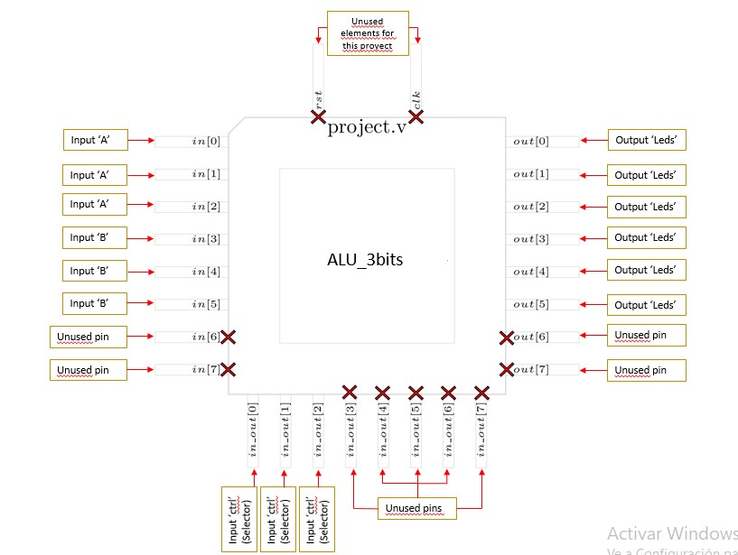

<!---

This file is used to generate your project datasheet. Please fill in the information below and delete any unused
sections.

You can also include images in this folder and reference them in the markdown. Each image must be less than
512 kb in size, and the combined size of all images must be less than 1 MB.
-->

## How it works

This device is a 3-bit ALU that generates 5 operations in parallel. The operations that the ALU performs are: addition, subtraction, multiplication, division and modulo operation.
The device has 2 inputs; A[3-bit] and B[3-bit] along with a 3-bit selector (Selector[3-bit]). It also has a single 6-bit output (OutPut[6-bit]). In the end, the design entails 15 pins in total; 9 input and 6 output pins.
The operation of this ALU is simple: At input A and B, the values ​​are set using switches, for example, A= 111 and B=101. To obtain the 5 different results through the different 5 operations that the ALU performs, the 3-bit selector (Selector[3-bits]) is used, therefore, using 3 switches we will place the result that we want to observe at the output.
The selector works as follows: since the selector is 3-bit, we will have 2^3= 8 combinations, but in this case we will only use the first 5 combinations in this way:

Combination 1 for sum: 000

Combination 2 for subtraction: 001

Combination 3 for multiplication: 010

Combination 4 for division: 011

Combination 5 for module: 100

The remaining combinations do not have an assigned operating function, therefore, the remaining combinations will not generate any result at the output of the device.

## How to test

Choose two values of 3-bits for the inputs A and B by using switches, for example: A=111 and B=101.
Then, use the 3-bit selector that has 3 switches to choose one of the 5 combinations to select an operation (sum[000], substraction[001], multiplication[010], division[011] and module[100]) so that it can be obtained the wanted results observed at the output (Leds).

For example: we choose the values A=111 and B=101. Then, if the 3-bit selector has the combination 011 then the operation will be A=111 / B=101 (division).

Another example, we choose the values A=111 and B=101. Then, if the 3-bit selector has the combination 010 then the operation will be A=111 * B=101 (multiplication).

Another example, we choose the values A=111 and B=101. Then, if the 3-bit selector has the combination 000 then the operation will be A=111 + B=101 (sum).

The results will be shown at the 6-bit output that uses 6 Leds to demonstrate the results of any of the 5 operations available in the ALU.

## External hardware

3-bit input "A": uses 3 switches.

3-bit input "B": uses 3 switches.

3-bit input "Selector": uses 3 switches.

6-bit output "Results": uses 6 Leds.

The mentioned inputs and outputs are respectively connected to the pins of the project circuit as shown in the pinout table.
  
For a better visualization, see the figure below.

