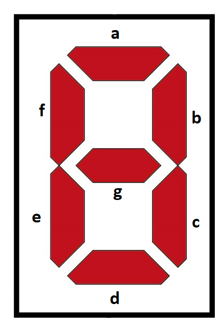

<!---

This file is used to generate your project datasheet. Please fill in the information below and delete any unused
sections.

You can also include images in this folder and reference them in the markdown. Each image must be less than
512 kb in size, and the combined size of all images must be less than 1 MB.
-->

## How it works

The operation is quite simple; when entering a 4-bit binary number, this number is shown at the output on a 7-segment common anode display in hexadecimal. The input "h" is a 4-bit vector, and the output "S" is a 7-bit vector. For the output "S", the most significant bit corresponds to segment "a", and so on, until the least significant bit, which corresponds to segment "g", as shown in figure 1. Since the display is anode common, to indicate that a segment is on, it is indicated with a "0".

{width=20%}

In the simulation shown in Figure 2, we can see that given a binary number that we introduce at the input, an output combination corresponds to the value to be shown on the 7-segment display in hexadecimal form, that is, given The binary number at the input corresponds to a 7-bit binary number, which is actually a pattern to light each segment of the 7-segment display, which obviously corresponds to the input number to be displayed.

According to Figure 3, the connections of the proposed circuit to those of the project in general are detailed in the pinout table.

The signals, both input and output, are logic highs and lows, that is, usually 5 volts to define a logic "1", and 0 volts for a logic "0". Let us remember that in the case of the output, an inverse logic is applied to the output since it is a common anode display, but in essence they are logical "1" and "0".

{width=70%}

## How to test

To check the operation, a 4-position dip switch is connected to the input, connected to a suitable power supply for the system, with its respective precautions (resistances), according to the number that you want to show on the display, for which appropriately connect each switch to the corresponding bit it represents. For the output, it is convenient to connect a 7-segment display (common anode) to corroborate its operation, according to the pins that correspond to each segment, mentioned in the previous section.

## External hardware

A 4-position DIP Switch for the input, which will serve to form the 4-bit binary number, along with its proper power supply, and a 7-segment display (common anode), to visualize its operation, connected with due precautions to avoid damage. Added to all this is a breadboard to place these components.

{width=30%}

{width=50%}

{width=30%}

