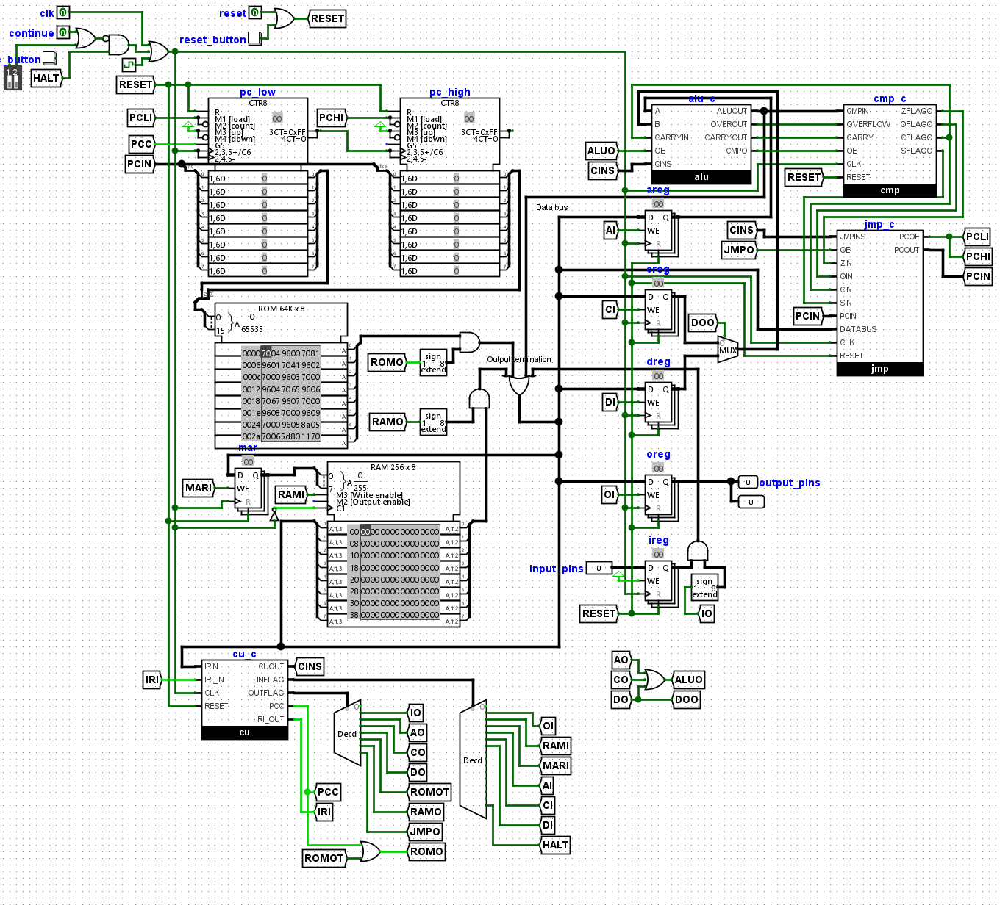

# Overview

This project is an 8-bit computer I originally designed in Logisim Evolution, which I am now porting to TinyTapeout for manufacturing. Below is the computer’s general architecture as shown in Logisim Evolution; however, certain modifications were made to ensure compatibility with VHDL and TinyTapeout.



The primary change includes the addition of a B register, alongside adjustments to enable ROM and RAM communication via SPI. Detailed information on these modifications is provided below.

The computer supports the following operations:

### Register Operations

The computer features four main registers: `a`, `b`, `c`, and `d`. It supports:
- Moving (`mov`) data between all registers.
- Comparing (`cmp`) values between registers, or between a register and a constant (0, 1, -1, or 255).
- Jumping (`jmp`) to labels and performing conditional jumps (`=`, `!=`, `<`, `<=`, `>`, `>=`) and relative jumps.

### ALU Operations

The ALU (Arithmetic Logic Unit) offers the following operations:
- Bitwise NOT (`~`) and negation (`-`).
- Increment (`+1`) and decrement (`-1`).
- Addition (`+`) and subtraction (`-`).
- Multiplication (`*`) and division (`/`).
- Bitwise AND (`&`) and OR (`|`).
- Signed mode operations and a carry flag for extended 8-bit addition/subtraction.

### Memory and I/O

- Load data from ROM into a register.
- Load data from RAM into a register.
- Save data from a register to RAM.
- Read from the input (`in`) port.
- Write to the output (`out`) port.

# Testing the Computer

The computer doesn't have any start signal and will begin read from the SPI ROM as soon as the clock signal (`clk`) starts ticking.

For examples of programs and a basic assembler, please see this repository (https://github.com/AeroX2/tt06-jrb8-computer/). \
Clone the repository and use the assembler with the following command:

```bash
python3 ./example_programs/assembler.py
```

A file dialog will open, allowing you to select a `*.j` file.

### Sample Program: 8-bit Fibonacci Sequence

Below is a simple 8-bit Fibonacci program in the custom `J` format (`fibonacci.j`):

```assembly
:start
load rom a 1
load rom b 0
:repeat
// Store the previous in c register
mov a c
// a = a + b
opp a+b
// This also corresponds to the carry flag being set
// So jump to start if a+b has overflowed  
jmp < start
// Output the value to the output pins
out a
// Restore the previous value in b register
mov c b 
jmp repeat
```

This program, when assembled, translates to the following hexadecimal format:

```hex
d0 01 d1 00 02 6c 33 00 00 f4 08 36 00 04
```

For a comprehensive guide on assembler instructions and their corresponding hex codes, refer to this document (https://docs.google.com/document/d/1ZVZw_Kt-KQHER0Wr5ty7JpUEeox_284Mih4rwE16FVM/edit?usp=sharing). \
You can also look at `roms/cu_flags.csv` in the `tt06-jrb8-computer` repository

The input register or the `i` register is mapped to `ui_in`\
The output register or the `o` register is mapped to `uo_out`

### Memory Mapping

To load data into the ROM, place it at offset 0. The address space is divided as follows:

- **ROM (Program Data):** 0x0000 to 0xFFFF
- **RAM:** 0x10000 to 0x1FFFF

#### RAM Addressing

RAM addressing is handled through two registers:

- **`mpage` Register:** Controls `0x1**00`
- **`mar` Register:** Controls `0x100**`

# External Hardware Requirements

External SPI storage is required for this computer, with mappings compatible with spi-ram-emu (https://github.com/MichaelBell/spi-ram-emu/). The following `uio` mappings are used:

```yaml
uio[0]: "cs rom"
uio[1]: "mosi"
uio[2]: "miso"
uio[3]: "sck"
```
