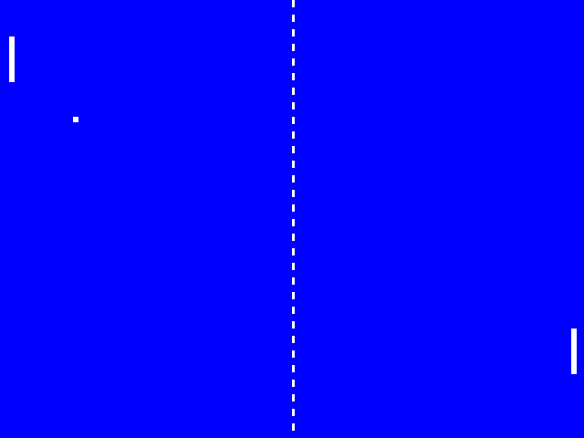

<!---

This file is used to generate your project datasheet. Please fill in the information below and delete any unused
sections.

You can also include images in this folder and reference them in the markdown. Each image must be less than
512 kb in size, and the combined size of all images must be less than 1 MB.
-->



## How it works

The pixel clock drives a VGA sync generator that scans the screen. Logic in `pong.v` determines whether to draw a pixel.

At each vsync, collisions are detected and the state of the game is updated.

For the paddle controls, the game uses modified versions of the debounce and encoder logic from the course to generate the control signals.

## How to test

Two vertical paddles and a ball should render at 640x480 resolution. A vertical "net" should be visible at the middle of the screen. Paddles should respond to the encoders. The ball should bounce from the top and bottom boundaries of the screen and should bounce off the paddles. The game should reset when the ball crosses beyond either paddle.

The verilog code can be run under verilator simulation:

```shell
cd src
make -B pong
./obj_dir/pong
```

SDL2 is a necessary dependency.

W and S control the left paddle. Up and down arrow keys control the right paddle.

## External hardware

- Two rotary encoders, one for each paddle.
- [TinyVGA](https://github.com/mole99/tiny-vga) Pmod or similar.
