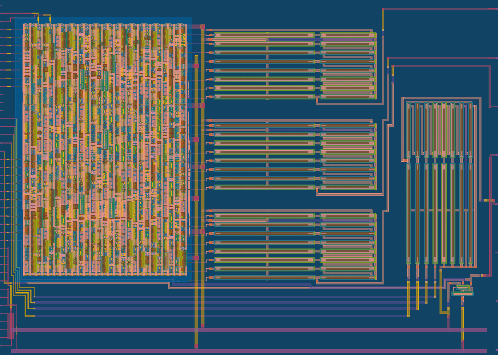
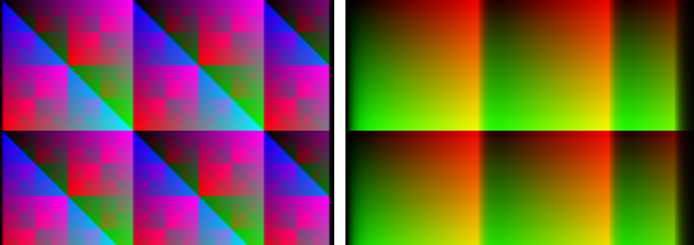
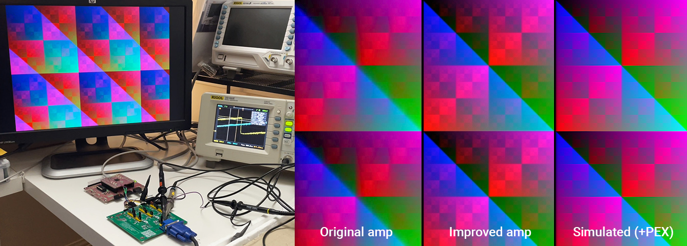
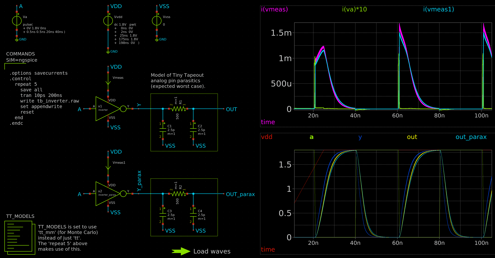
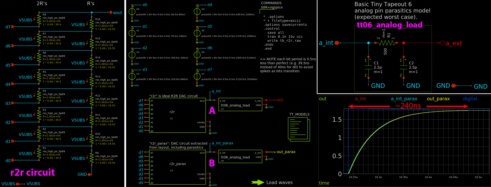

<!---
You can also include images in this folder and reference them in the markdown. Each image must be less than
512 kb in size, and the combined size of all images must be less than 1 MB.

NOTE: I've used &#126; instead of actual `~` to avoid a mismatch between GFM and the PDF doc generation
(i.e. GFM sees this character as a strikethrough marker, but the PDF doc generation does not).
Note that `~` while commonly called a tilde is actually the "equivalency sign" (tilde is up high).
Ideally I would use &#x2053 ('swung dash') which is technically probably the correct symbol for
"approximate ranges" but this doesn't work in the PDF generator.
-->

## What is this thing?

<!--  -->

A simple analog/mixed-signal project I created in the 1st round of Matt Venn's Zero to ASIC **Analog Course** beta. **This design has been demonstrated to work in silicon.** For silicon test results, see my journal entry: https://algo.org/journal/0226

The design comprises:

*   Simple CMOS inverter. That was my very first custom layout attempt.
*   Digital block generating a few basic 24b-colour (RGB888) VGA test patterns.
*   Analog RGB out (digital block VGA outputs via 3x 8-bit R2R DACs).
*   An extra 4-bit R2R DAC.

## VGA test pattern outputs

The design's *main* purpose is to generate VGA test patterns that were hoped to look as good as these simulations:

The left-hand pretty pattern is "MODE_XORS" (`ui_in==8'b0011_0000`) while the right-hand gradients pattern is "MODE_RAMP" (`ui_in==8'b0001_0000`).

Notice there is some horizontal smearing (more exaggerated in the right-hand image of the red/green mixes).

Actual results from silicon testing (seen above) are pleasing.

## CMOS inverter

Pretty simple:

*   Its input is `uio_in[7]` (bidir 7).
*   Its output goes to two places: `ua[3]` (analog) and `uio_out[2]` (digital).
*   I'd expect its digital out performance to be better: the TT digital mux has more buffering & less loading than the TT analog mux.

The graphs accompanying the schematics simulate *analog* out is expected to be stable (enough) within 10ns; relatively poor performance characteristic of the TT analog mux loading. I expect bigger transistors could drive this harder and make it faster.

## Extra 4-bit R2R

4th instance of my 8-bit R2R DAC cell grounds the 4 LSB, connecting the 4 MSB to spare bidir inputs (`uio_in[6:4]`) with DAC output via `ua[4]`.

## How it works

TBC!

The internal R2R DACs for each of the RGB outputs just go directly (unbuffered) to the analog output pins, where they are subject to the loading of the TT06 analog mux (estimated to be about 500&ohm; and 5pF). This combination means their slew rate was expected to be pretty bad (at least by VGA timing standards): On the order of 240&#126;360ns (or 6&#126;9 horizontal pixels) going from 0V to full 1.8V. In the chips I received, it was a little better than that.

In a future design I plan to implement better internal buffering to help mitigate some of the TT analog mux load.

Select from a few simple test patterns in the VGA controller by having different `ui_in` values asserted while coming out of reset. the VGA controller digital block generates 8-bit digital outputs per each of red, green, and blue channels. These go into 3 basic RDACs to generate analog voltage outputs on `ua[2:0]` (`{B,G,R}`) in the range 0-1.8V (probably &#126;10k&ohm; impedance).

## How to test

TBC!

1.  Supply a 25MHz clock
2.  Set `ui_in` to `8'b0001_0000`
3.  Assert reset -- NOTE: I didn't put a synchroniser on it, so it might (?) do a dirty reset -- if that happens, it could be worked around by slowly/manually clocking around the reset pulse, I guess.
4.  With a scope, trigger on the `uo_out[3]` rising edge (VSYNC) and hopefully see `ua[0]` ramp from 0V to 1.8V within 10.24us
5.  With this mode (as selected in step 2 above), `ua[1]` will also ramp, but per line (instead of per pixel), as will `ua[2]` (per frame).
6.  For the pretty XORs pattern, set `ui_in` to `8'b0011_0000` and assert reset again.

NOTE: For actual VGA output, you need the VSYNC and HSYNC signals (connecting them each with a 1k&ohm; resistor in series with their respective VGA cable connection should do). You will almost certainly need some sort of output buffering between this design and a VGA display, because the design outputs a high-impedance (&#126;10k&ohm; but maybe a little worse) 0&#126;1.8V range, while a VGA display expects 0&#126;0.7V at 75&ohm;. See https://algo.org/pcb/tt06i for an example board that covers all this.

Other notes for testing:

*   Digital block's mode selection is asserted via `ui_in` *during reset*
*   For safety, initial test should be done with no analog output loading, and with all of `ui_in` pulled low (which selects pass-thru mode AND ensures all DAC *inputs* internally are low, so hopefully no current).
*   RGB222 digital outputs compatible with the [Tiny VGA PMOD].

## External hardware

This is if you want to see an actual analog VGA display:

*   10MHz-capable (or better; preferably 25MHz) opamps on each of the R, G, B outputs, to both make them into low-impedance (matching 75&ohm; typical VGA termination), and also to level-shift from 0&#126;1.8V to 0&#126;0.7V. See https://algo.org/pcb/tt06i for an example "interposer board" (aka "sandwich board") which uses an OPA3355 video op-amp circuit with VGA connector, and is intended to sit between the TT06 chip's breakout board (aka "carrier") and the TT06 demo board.
*   Optionally the [Tiny VGA PMOD] plugged into the dedicated output port (`uo_out`).

[Tiny VGA PMOD]: https://github.com/mole99/tiny-vga
