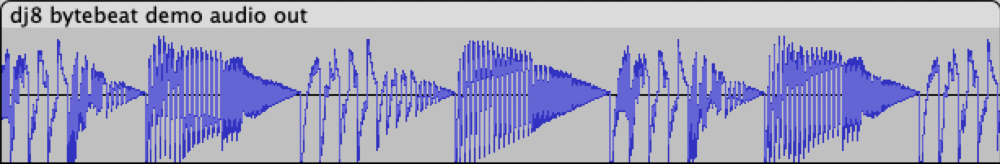

<!---

This file is used to generate your project datasheet. Please fill in the information below and delete any unused
sections.

You can also include images in this folder and reference them in the markdown. Each image must be less than
512 kb in size, and the combined size of all images must be less than 1 MB.
-->

## How it works

DJ8 is a 8-bit CPU implemented in VHDL, originally developped for XCS10XL featuring:
- 8 x 8-bit register file
- 3-4 cycles per instruction
- 15-bit address bus
- 8-bit data bus
- Built-in 256-bytes demo ROM with 2 demos

Sample assembly code could be found in test bench and demo ROM.

Other implementations:

- [TT07 DJ8 8-bit CPU w/ DAC - Verilog, Mixed-signal, 8-bit DAC](https://github.com/dvxf/tt07-dj8v-dac)
- [TTIHP0P2 DJ8 8-bit CPU - Verilog](https://github.com/dvxf/ttiph0p2-dj8v)

### Memory Map

| From | To | Description
|--|--|--|
| 0x0000 | 0x7fff | External memory
| 0x8000 | 0xffff | Internal Test ROM (256 bytes, mirrored)

#### External memory map if using the recommended setup (see pinout)

| From | To | Description
|--|--|--|
| 0x2000 | 0x3fff | External RAM (32 bytes)
| 0x4000 | 0x5fff | External Flash ROM (16KB)

### Registers

There are 8 general purposes 8-bit registers (A,B,C,D,E,F,G,H), two flag registers (CF, ZF), and 16-bit PC.

For memory addressing, 16-bit combined registers EF and GH are used.

At reset time, PC is set to 0x4000. All other registers are set to 0x80.

### Instruction Set
For future compatibility, please set the don't care bits (`?`) to `0`.

#### ALU reg, imm8: Immediate ALU operation

| 15 | 14 | 13 | 12 | 11 | 10 | 9 | 8 | 7 | 6 | 5 | 4 | 3 | 2 | 1 | 0 |
| --- | --- | --- | --- | --- | --- | --- | --- | --- | --- | --- | --- | --- | --- | --- | --- |
| 1 | 1 | A | A | A | D | D | D | I | I | I | I | I | I | I | I |

- A : ALU operation
  - `000`: ADD: reg = reg + imm8
  - `001`: ADC: reg = reg + imm8 + CF
  - `010`: SUBC: reg = reg - (imm8 + CF)
  - `011`: MOVR: reg = reg
  - `100`: XOR: reg = reg ^ imm8
  - `101`: OR: reg = reg | imm8
  - `110`: AND: reg = reg & imm8
  - `111`: MOVI: reg = imm8
- D : register
- I : imm8

#### ALU dest, src, A {,shift}: ALU operation with src register & register A

| 15 | 14 | 13 | 12 | 11 | 10 | 9 | 8 | 7 | 6 | 5 | 4 | 3 | 2 | 1 | 0 |
| --- | --- | --- | --- | --- | --- | --- | --- | --- | --- | --- | --- | --- | --- | --- | --- |
| 1 | 0 | A | A | A | D | D | D | S | S | S | ? | F | F | 0 | 0 |

- A : ALU operation
  - `000`: ADD: dest = src + A
  - `001`: ADC: dest = src + A + CF
  - `010`: SUBC: dest = src - (A + CF)
  - `011`: MOVR: dest = src
  - `100`: XOR: dest = src ^ A
  - `101`: OR: dest = src | A
  - `110`: AND: dest = src & A
  - `111`: MOVI: dest = A
- D : dest register
- S : src register
- F : final shift operation
  - `00`: No shift
  - `01`: Shift right logical (shr)
  - `10`: Shift right arithmetic (sar)

#### ALU dest, [mem], A {,shift}: ALU operation with memory & register A

| 15 | 14 | 13 | 12 | 11 | 10 | 9 | 8 | 7 | 6 | 5 | 4 | 3 | 2 | 1 | 0 |
| --- | --- | --- | --- | --- | --- | --- | --- | --- | --- | --- | --- | --- | --- | --- | --- |
| 1 | 0 | A | A | A | D | D | D | ? | ? | ? | M | F | F | 1 | 0 |

- A : ALU operation
  - `000`: ADD: dest = [mem] + A
  - `001`: ADC: dest = [mem] + A + CF
  - `010`: SUBC: dest = [mem] - (A + CF)
  - `011`: MOVR: dest = [mem]
  - `100`: XOR: dest = [mem] ^ A
  - `101`: OR: dest = [mem] | A
  - `110`: AND: dest = [mem] & A
  - `111`: MOVI: dest = A
- D : dest register
- M: memory mode
  - `0`: [GH]
  - `1`: [EF]  
- F : final shift operation
  - `00`: No shift
  - `01`: Shift right logical (shr)
  - `10`: Shift right arithmetic (sar)
  
#### MOVR [mem], reg: Store content of register in memory
| 15 | 14 | 13 | 12 | 11 | 10 | 9 | 8 | 7 | 6 | 5 | 4 | 3 | 2 | 1 | 0 |
| --- | --- | --- | --- | --- | --- | --- | --- | --- | --- | --- | --- | --- | --- | --- | --- |
| 1 | 0 | 0 | 1 | 1 | D | D | D | ? | ? | ? | M | ? | ? | 0 | 1 |

- D: register
- M: memory mode
  - `0`: [GH]
  - `1`: [EF]

#### Jxx imm12: Conditional or unconditional jump to absolute address
| 15 | 14 | 13 | 12 | 11 | 10 | 9 | 8 | 7 | 6 | 5 | 4 | 3 | 2 | 1 | 0 |
| --- | --- | --- | --- | --- | --- | --- | --- | --- | --- | --- | --- | --- | --- | --- | --- |
| 0 | 0 | J |  J | I | I | I | I | I | I | I | I | I | I | I | I |

- J: jmpcode
    - `01`: Jump if zero (JZ)
    - `10`: Jump if not zero (JNZ)
    - `11`: Unconditional jump (JMP)
- I: imm12
  - PC = (PC & 0xe000) | (imm12 << 1)

#### JMP GH: Unconditional jump to address GH
| 15 | 14 | 13 | 12 | 11 | 10 | 9 | 8 | 7 | 6 | 5 | 4 | 3 | 2 | 1 | 0 |
| --- | --- | --- | --- | --- | --- | --- | --- | --- | --- | --- | --- | --- | --- | --- | --- |
| 0 | 1 | ? |  ? | ? | ? | ? | ? | ? | ? | ? | ? | ? | ? | ? | ? |

## Pinout
Due to TT06 IO constraints, pins are shared between *Address bus LSB* and *Data bus OUT*. It means that during memory write instructions, the address space is only 128 bytes.

| Pins | Standard mode | During memory write execute+writeback cycles
|--|--|--|
| ui[7..0] | Data bus IN | Data bus IN 
| uio[7..0] | Address bus LSB (7..0) | ***Data bus OUT***
| uo[6..0] | Address bus MSB (14..8) | Address bus MSB (14..8)
| uo[7] | Write Enable | Write Enable

You can connect a 8KB parallel Flash ROM + 32b SRAM without external logic and use uo[6] for RAM OE# and uo[5] for Flash ROM OE#.

To get a bidirectional data bus (needed for SRAM), uio bus must be connected to ui bus with resistors. To be tested!

## How to test

An internal test ROM with two demos is included for easy testing. Just select the corresponding DIP switches at reset time to start the demo (technically, a ***jmp GH*** instruction will be seen on the data bus thanks to the DIP switches values, with GH=0x8080 at reset).

### Demo 1: Rotating LED indicator
| SW1 | SW2 | SW3 | SW4 | SW5 | SW6 | SW7 | SW8 |
|--|--|--|--|--|--|--|--|
| 0 | 0 | 0 | 0 | 0 | 0 | 1 | 0 |

No external hardware needed. This demo shows a rotating indicator on the 7-segment display. Its speed can be changed with DIP switches, the internal delay loop is entirely deactivated when all switches are reset.

### Demo 2: Bytebeat Synthetizer

| SW1 | SW2 | SW3 | SW4 | SW5 | SW6 | SW7 | SW8 |
|--|--|--|--|--|--|--|--|
| 0 | 0 | 0 | 0 | 0 | 1 | 1 | 0 |

Modem handshakes sound like music to your hears? It's your lucky day! Become a bit-crunching DJ thanks to 256 lo-fi glitchy settings.

Connect a speaker to uo[4] or use [Tiny Tapeout Simon Says PMOD](https://github.com/urish/tt-simon-pmod). Play with the DIP switches to change the loop settings. 

It is highly recommended to add a simple low-pass RC filter on the speaker line to filter out the buzzing 8kHz carrier. Ideal cut-off frequency between 3kHz and 8kHz, TBD.

Set SW1 and/or SW2 at reset time to adjust speed in case the design doesn't run at 14MHz.

## External hardware

- No external hardware for Demo 1
- Speaker for Demo 2
- Otherwise: Parallel Flash ROM + optional SRAM
