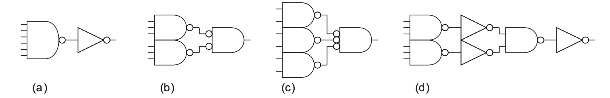
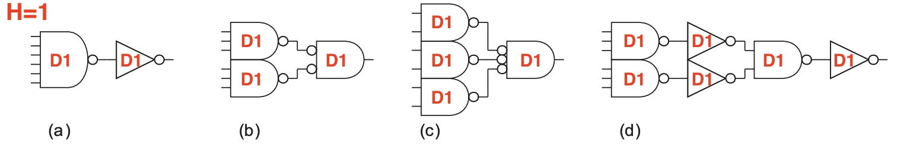
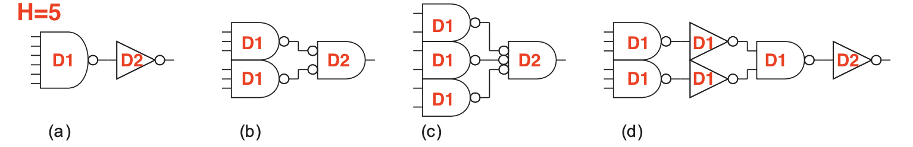
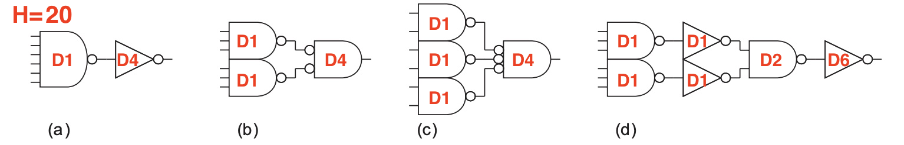
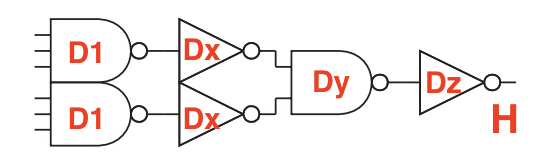
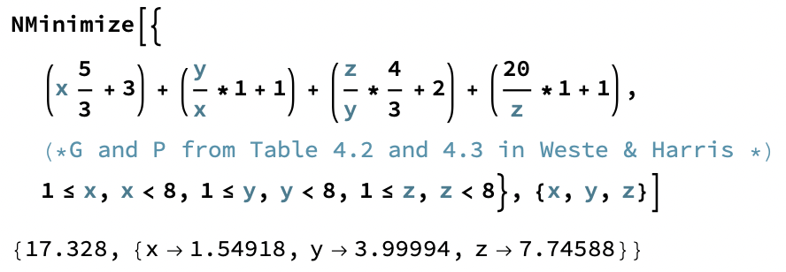
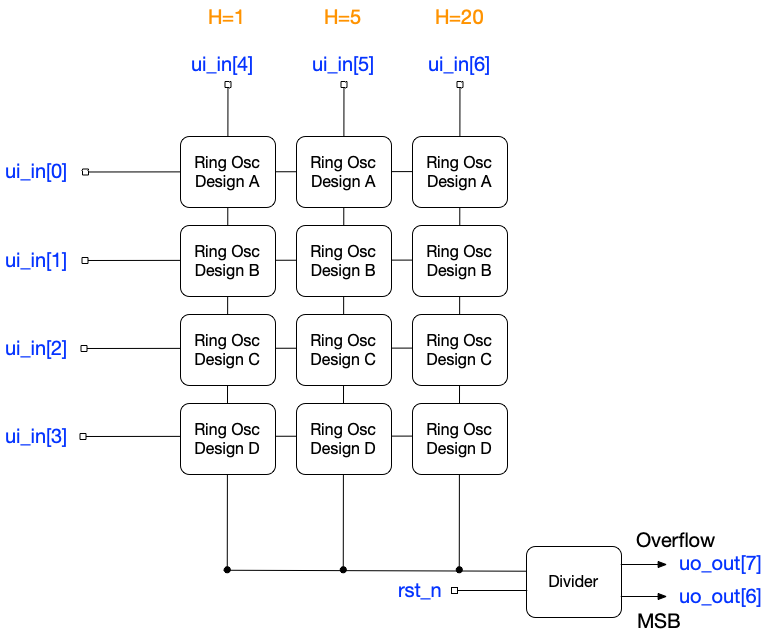

## Project

Measure the delay of the implementations of problem 4.11 in Weste & Harris

https://pages.hmc.edu/harris/cmosvlsi/4e/index.html


## Problem 4.11

Consider four designs of a 6-input AND gate shown below. Develop an expression for the delay of each path if the path electrical effort is H.  What design is fastest for H = 1? For H = 5? For H = 20? 



For this problem, H measures the capacitance the AND gate
needs to drive.   It's the output capacitance divided by the input capacitance of one inverter. So H=20 means the output capacitance is the same as 20 inverters.

For an example of when this could occur, consider this AND gate as a row decoder, and H is the number of columns. 

## The Theory of Logical Effort

For more details see

* Weste & Harris Chapter 4 Section 4 (4th Edition)
* https://www.ece.ucdavis.edu/~vojin/CLASSES/EPFL/Papers/LE-orig-paper.pdf
* https://shop.harvard.com/book/9781558605572

This is the linear delay model and the basic theory is the delay of a gate can be determined by the equation:

D = G * H + P

| Variable | Name | Description |
| -------- | ------- | ------- |
| H | Electrical Effort | The amount of output capacitance this gate needs to drive relative to the input capacitance of an inverter. |
| G | Logical Effort | Logical Effort is a rough measure of the gate's complexity. It can be thought of as the amount of input capacitance relative to an inverter with equal drive strength, the amount of drive strength when the input capacitance is the same as an inverter, or the slope of the fanout line. More "complex" gates will have higher logic efforts.  |
| P | Parasitic Delay | Parasitic delay measures the output capacitance of this gate relative to the output capacitance of an inverter of the same strength. More complex gates have more output capacitance. |
| D | Stage Delay | The delay of this stage relative to the delay of one inverter. |

The linear delay model has several possible issues (Weste & Harris covers this), but critically, it ignores wires. It's known to work well enough for 0.25u processes and above, where wire loading is less significant relative to the delay and loading of the transistors themselves. We'll see how well it works at 130nm for Sky130A in the TinyTapeout/OpenLane flow, where placement density is not particularly high. 


## What I implemented





## How I determined the drive values

The key is to notice that when we increase the drive of one cell, we increase the load on the previous cell. This changes the electrical effort of that cell. So, for part D we end up with the following chain



There are equations one can use to optimize this but I just used mathematica because it's faster.   Here is how I solved H=20 for part D.



Then I just used the cell with the nearest drive from the library and checked the result was within one inverter delay of the optimal value.   

This procedure is roughly equivalent to what ABC does in the OpenLane flow after mapping. Remember that although ABC can optimize drive, it can't modify structure. As we can see, the choice of structure does have implications on performance, even after the drive is optimized. 

## Calculated delays with optimized drive

| Design | H=1 | H=5 | H=20 |
| -------- | ------- | ------- | ------- |
| A | 10.7 |  14.8 |  22.7 |
| B | 8.3 | 12.5 | 20.0 |
| C |  9.7 | 14.5 | 23.0 |
| D | 12.0 |  14.8 |  18.6 |

These are in units of one inverter delay which is about 70pS in Sky130A. 

## What is drive?

Drive counts the number of equivalent parallel gates to increase the output current the resulting compound gate. More gates in parallel allows sourcing larger load capacitances with higher dv/dt at the cost of input capacitance, area, and power. 

Opting for an integrated cell for the parallel gates is a practical choice. It empowers the layout engineer to implement strategies that effectively minimize wire loading and output capacitance of the overall structure, thereby enhancing the gate's performance. 

See the various incarnations of nand2 in Sky130A for an example. 

https://diychip.org/sky130/sky130_fd_sc_hd/cells/nand2/

To those with a more analog bend you might think the previous gate is acting like a pre-amplifier, and you're right.  It is exactly the same.  You might also notice the inverter is basically a class B stage, except it inverts.  It is and that's what makes it such a good reference when one considers driving loads. 

## This provides a bit of theory behind the ZtA video

[When are 2 logic gates faster than 1?](https://www.youtube.com/watch?v=ajwZVAVo3yk)

The video is a bit different than this problem in that it kept the load constant but shrunk the period constraints.  

Here we keep the period constraint the same but increase the load.  At the end of the day it's the same idea in that we're changing I to get a different dv/dt for a given C. 

## Test structure 



## Raw Delay Calculations
```
In[1]:= NMinimize[{
(x 5/3+3)+(y/x*1+1)+(z/y*4/3+2)+(5/z*1+1),(*G and P from Table 4.2 and 4.3 in Weste & Harris *)
1<=x,x<8,1<=y,y<8,1<=z,z<8},{x,y,z}]
Out[1]= {14.303,{x->1.09546,y->2.00004,z->2.73865}}
In[2]:= (*Part A*)
In[3]:= Round[(H/x 1+1+(x (6+2)/3+6))/.{H->{1,5,20},x->{1,2,4}},0.1]
Out[3]= {10.7,14.8,22.7}
In[4]:= (*Part B*)
In[5]:= Round[((H/x 5/3+2)+(x 5/3+3))/.{H->{1,5,20},x->{1,2,4}},0.1]
Out[5]= {8.3,12.5,20.}
In[6]:= (*Part C*)
Round[((H/x 7/3+3)+(x 4/3+3))/.{H->{1,5,20},x->{1,2,4}},0.1]
Out[6]= {9.7,14.5,23.}
In[7]:= (*Part D*)
In[8]:= 
Round[((x 5/3+3)+(y/x*1+1)+(z/y*4/3+2)+(H/z*1+1))/.{H->{1,5,20},x->{1,1,1},y->{1,1,2},z->{1,2,6}},0.1]
Out[8]= {12.,14.8,18.}
```
Hopefully there are no typos or transcription errors.
