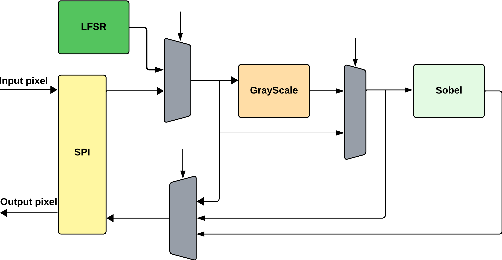

<!---

This file is used to generate your project datasheet. Please fill in the information below and delete any unused
sections.

You can also include images in this folder and reference them in the markdown. Each image must be less than
512 kb in size, and the combined size of all images must be less than 1 MB.
-->

## How it works

This project performs grayscale conversion and Sobel filtering with the aim of detecting edges in an image.

Below is a block diagram of the implementation:



## How to test

It is necessary for the pixels to be sent via an SPI protocol; for this purpose, the input ```ui_in[2:0]``` is designated as follows:

* ```ui_in[0]``` &rarr; SPI Clock
* ```ui_in[1]``` &rarr; Chip Select
* ```ui_in[2]``` &rarr; Input Pixel
  
As shown in the previous image, there are some processing options:

1. Bypass &rarr; Returns the input pixel unprocessed.
2. Grayscale &rarr; Returns the pixel converted to grayscale, so it is recommended that the input pixel be RGB.
3. Sobel &rarr; Returns the edge detection corresponding to the input pixel, so it is recommended that the input pixel be grayscale.
4. Grayscale + Sobel &rarr; Returns the edge detection of the input pixel by performing both grayscale processing and the Sobel filter, so it is recommended that the input pixel be  RGB.

To select one of the processing options, the input ```ui_in[4:3]``` is designated as follows:

* ```ui_in[4:3]``` = $00$ &rarr; Grayscale + Sobel 
* ```ui_in[4:3]``` = $01$ &rarr; Sobel
* ```ui_in[4:3]``` = $10$ &rarr; Grayscale
* ```ui_in[4:3]``` = $11$ &rarr; Bypass

To perform the Sobel filter processing, it must be enabled according to the selected processing. This can be enabled or disabled as needed through the input ```ui_in[5]```, where $1$ enables and $0$ disables.

The result of the processing corresponds to the output ```uo_out[0]```.

There is also a functionality for the input to the different processing options to come from an internal LFSR block; for this purpose, the pins ```uio_in[3:2]``` are dedicated for input.

## External hardware

Any device that allows sending data via an SPI protocol, like a Raspberry Pi.
