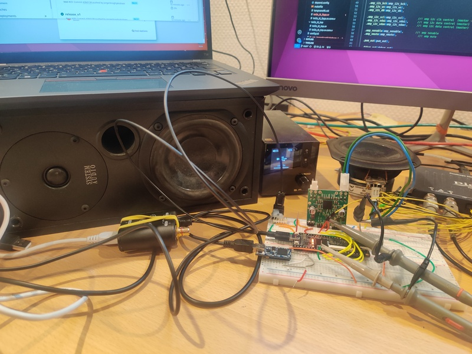

<!---

This file is used to generate your project datasheet. Please fill in the information below and delete any unused
sections.

You can also include images in this folder and reference them in the markdown. Each image must be less than
512 kb in size, and the combined size of all images must be less than 1 MB.
-->

## How it works

SPDIF audio is a well known and commonly used industry standard for audio distibution on a single optical or electical interface. It signal both audio data and the clock in the same signal.
I2S is a well known and commenly used industry standard for audio distibution on a 3 wire interface. It has clock(BCK), left/right sync(WS) and data signal(D0).

Digial audio amplifiers and DAC's often use I2S as input interface. 

I have coded up a spdif converter that oversample the spdif using a 27Mhz system clock.
One process regenerates the i2c_bck clock signal by counting number of system clock between 
spdif input data edges. 
The spdif singal is a phase mark kind of encoding with a couple of sync words. This decoder
only looks for Left and right sync word that indecate when to toggle the i2c_ws signal. 

The audio PCM samples will get decode by looking for phase/mark changes and the pcm bits are 
shifted in to a left and right pcm_sample fifo. 
From here the i2s_d0 signal is generate by shifting out of the non active fifo in reversed order. 

### Code base 

The system consist of 3 major block: 
- A register bank
- I2C interface to read/write to the register bank
- The audio interface 

The register back is written in Golang and generates HDL systemVerilog to support packed structs and packages. All systemVerilog sources are converted to verilog using sv2v during the FPGA build script used for testing. 

The register map has a seciton for the audio interface - and holds 8 registers for write operation through a dedicated I2C interface to the amplifier. 
Default it will set amplifer volume on address 0x40 and amplifer audioformat to std i2s. 
More commands can be added by software through the system I2C interface. 

## How to test

If no smoke coming out after supply has been applied all good :-)

Apply optical audio from a spdif source - if sounds good - it works :-) 

## External hardware

Amplifier module MA12070p and ftdi usb to i2c module :-)
