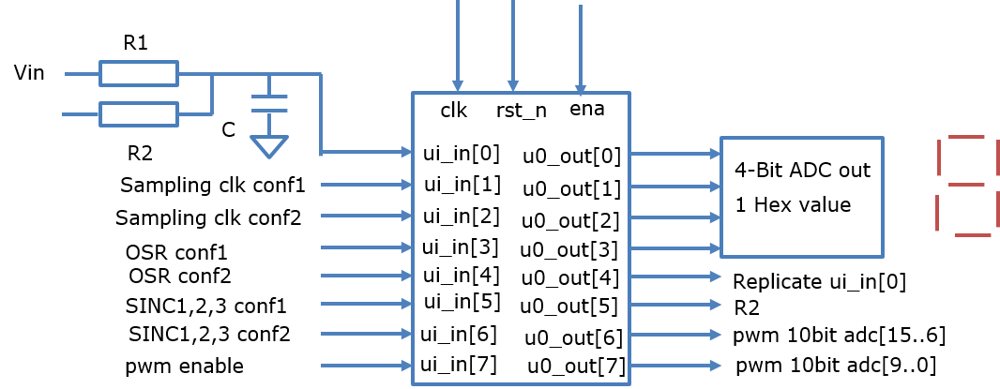
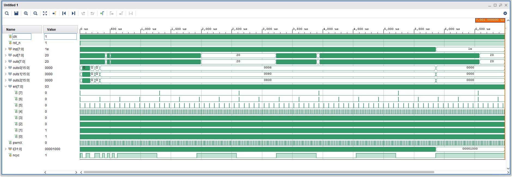
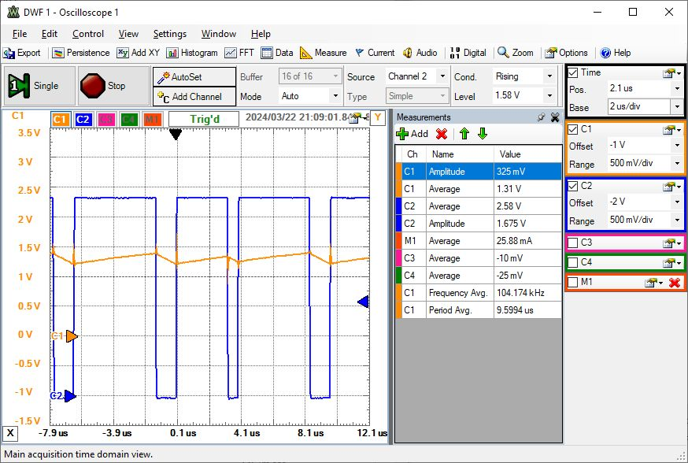

<!---

This file is used to generate your project datasheet. Please fill in the information below and delete any unused
sections.

You can also include images in this folder and reference them in the markdown. Each image must be less than
512 kb in size, and the combined size of all images must be less than 1 MB.
-->

## How it works

A 1st order passive sigma delta modulator can be realized by attaching R1, R2 and C to a digital input.
Further information is found here:
https://personalpages.hs-kempten.de/~vollratj/InEl/SigmaDelta_ADC_real.html

A high level simulator:
https://personalpages.hs-kempten.de/~vollratj/InEl/SigmaDelta.html

## How to test

Add the RC network and apply a DC voltage at the input in0 and out5.
Select sampling, oversamplingrate and filter in1..6.
The 4 output lines 0..3 should give a 4-Bit value.
The out6,7 give a pwm signal changing with the input voltage.

All subcircuits were tested in one testfile tb_sigdel do be able to observe all signals.

## BASYS3 board measurements

22k resistors were used with 100 and 560 pF capacitances.

The signals at the capacitor and the digital signal inx were measured 
with an Electronic Explorer board.

Measurement showed a missing enable signal for inx sampling.

The table shows valid configuration options.

inp[6] 	inp[5] 	inp[4] 	inp[3] 	inp[2] 	inp[1] 	Cint 	fCLK=50MHz 	T=20ns 	OSR 	Ldmax 	Bits

0 	1 	0 	0 	0 	0 	100pF 	SINC1 fsCLK 	40ns 	256 	LD7 	8

0 	1 	0 	0 	0 	1 	        SINC1 fsCLK 	160ns 	64 	      6

0 	1 	0 	1 	0 	0 	100 pF 	SINC1 fsCLK 	40ns 	1024 	LD9 	10

0 	1 	0 	1 	0 	1 	      	SINC1 fsCLK 	160ns 	256 	8

0 	1 	0 	1 	1 	0 	      	SINC1 fsCLK 	640ns 	64 	  6

0 	1 	1 	0 	0 	0 	       	SINC1 fsCLK 	40ns 	4096 	12

0 	1 	1 	0 	0 	1 		SINC1 fsCLK 	160ns 	1024 	10

0 	1 	1 	0 	1 	0 	560 pF 	SINC1 fsCLK 	640ns 	256 		8	ok

0 	1 	1 	0 	1 	1 	560pF 	SINC1 fsCLK 	2560ns 	64 	LD5 	6	ok

0 	1 	1 	1 	0 	0 		SINC1 fsCLK 	40ns 	16384 		14	

0 	1 	1 	1 	0 	1 	560 pF 	SINC1 fsCLK 	160ns 	4096 		12	ok

0 	1 	1 	1 	1 	0 	560 pF 	SINC1 fsCLK 	640ns 	1024 	10	ok

0 	1 	1 	1 	1 	1 	560 pF 	SINC1 fsCLK 	2560ns 	256 		8	ok

1 	0 	0 	0 	0 	1 	      	SINC2 fsCLK           	64  12

1 	0 	0 	0 	1 	0 	      	SINC2 fsCLK 	        16	8

1 	0 	0 	1 	1 	0 	      	SINC2 fsCLK         	64	12

1 	0 	0 	1 	1 	1 	560pF 	SINC2 fsCLK 		16 	LD7 	8

1 	0 	1 	0 	1 	1 	560 pF 	SINC2 fsCLK 		64 	LD11 	12

1 	1 	0 	0 	1 	0 		      SINC3 fsCLK 	16 	12

1 	1 	0 	0 	1 	1 	560 pF 	SINC3 fsCLK 		4 	LD5 	6

1 	1 	0 	1 	1 	1 	560 pF 	SINC3 fsCLK 		16 	LD11 	12

A better configuration scheme should be chosen in the next design. 
Higher fsCLK have lower capacitance.

A better multiplexing to the 4 Bit output with a case statement was done at the FPGA
and the routing of out[3:0] done to led[3:0].

Figure: Oscilloscope picture BASYS3 FPGA not(inx)(blue) and inp[0](orange)

## Summary

It is possible with this circuit to look at the influence of R, C and 
oversampling on the accuracy of a 1st order sigma delta ADC.

Bad R,C values can cause non linearities or signal limitation to VDD and ground.

The order of the SINC filter can lead to less resolution (SNR) than expected.

The order of the SINC filter should be at least one more than the sigma delta modulator.

The pwm signal has 10 bits and can be used for more precise output values.

## References
Martin Knauer, Jörg Vollrath, 'Implementation and Testing of a FPGA Based Sigma Delta Analog to Digital Converter', 
[58. MPC Workshop, Reutlingen July 2017](https://www.mpc-gruppe.de/workshopbaende)

