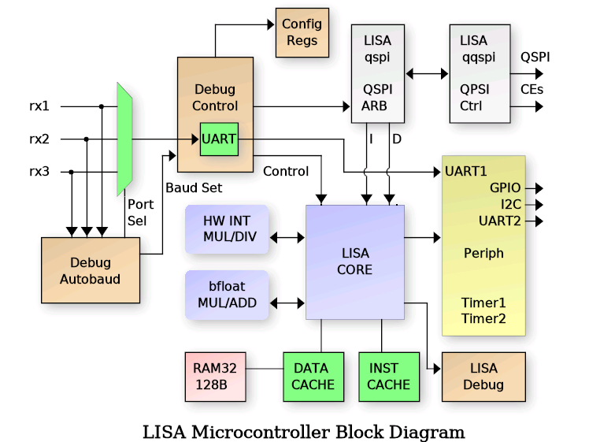
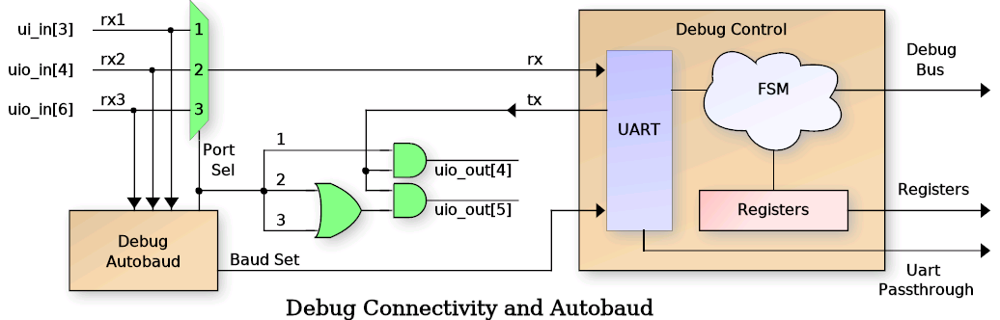
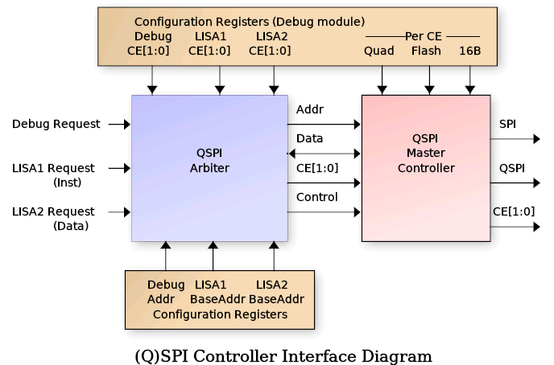
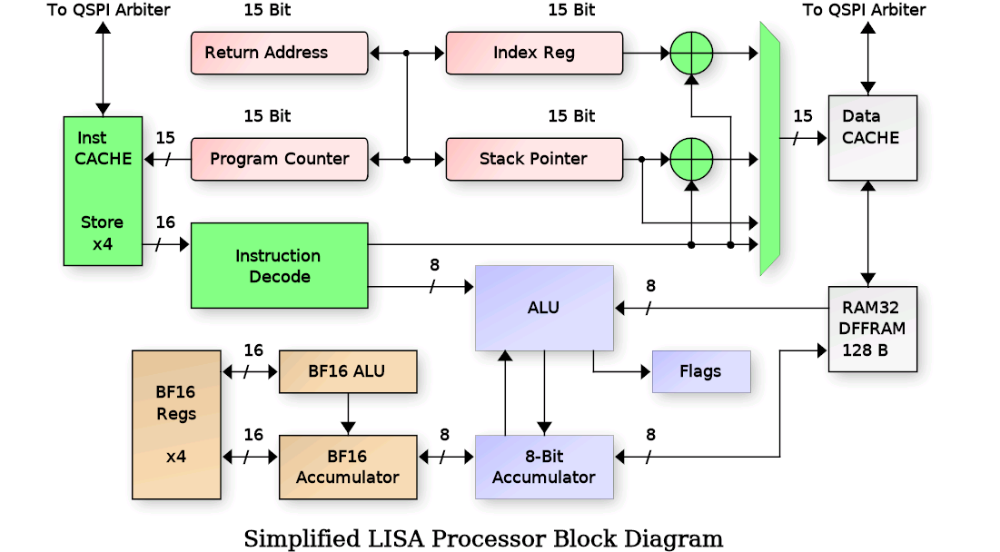
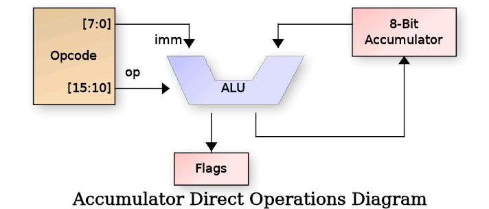
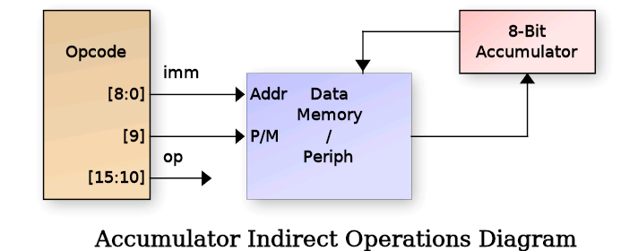
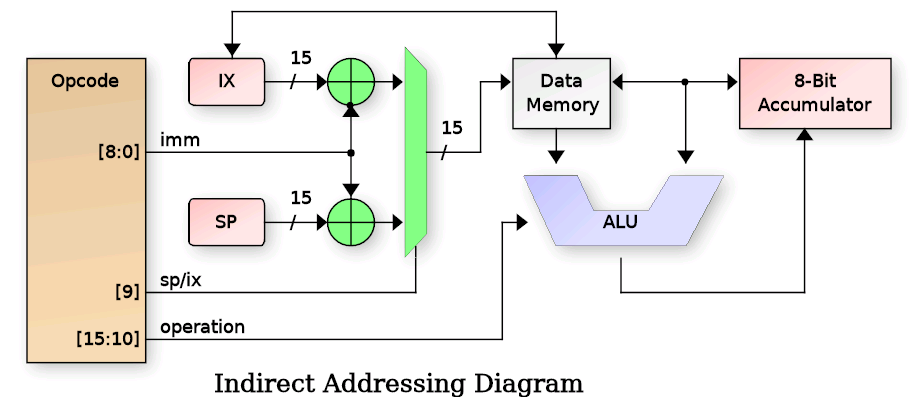
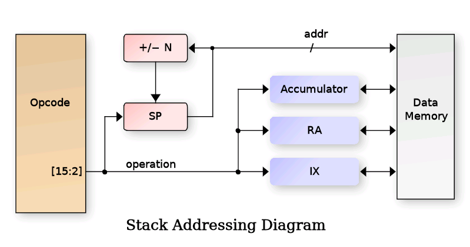
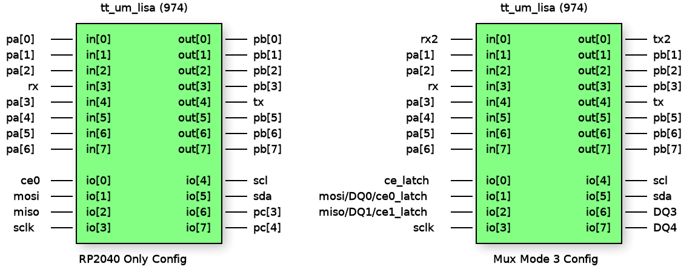

## What is LISA?
                                 
It is a Microcontroller built around a custom 8-Bit Little ISA (LISA)
microprocessor core.  It includes several standard peripherals that
would be found on commercial microcontrollers including timers, GPIO,
UARTs and I2C.
The following is a block diagram of the LISA Microcontroller:

   - The LISA Core has a minimal set of register that allow it to run C programs:
      - Program Counter + Return Address Resister
      - Stack Pointer and Index Register (Indexed DATA RAM access)
      - 8-bit Accumulator + 16-bit BF16 Accumulator and 4 BF16 registers

### Deailed list of the features
   - Harvard architecture LISA Core (16-bit instruction, 15-bit address space)
   - Debug interface
      * UART controlled
      * Auto detects port from one of 3 interfaces
      * Auto detects the baud rate
      * Interfaces with SPI / QSPI SRAM or FLASH
      * Can erase / program the (Q)SPI FLASH
      * Read/write LISA core registers and peripherals
      * Set LISA breakpoints, halt, resume, single step, etc.
      * SPI/QSPI programmability (single/quad, port location, CE selects)
   - (Q)SPI Arbiter with 3 access channels
      * Debug interface for direct memory access
      * Instruction fetch
      * Data fetch
      * Quad or Single SPI.  Hereafter called QSPI, but supports either.
   - Onboard 128 Byte RAM for DATA / DATA CACHE
   - Data bus CACHE controller with 8 16-byte CACHE lines
   - Instruction CACHE with a single 4-instruction CACHE line
   - Two 16-bit programmable timers (with pre-divide)
   - Debug UART available to LISA core also
   - Dedicated UART2 that is not shared with the debug interface
   - 8-bit Input port (PORTA)
   - 8-bit Output port (PORTB)
   - 4-bit BIDIR port (PORTC)
   - I2C Master controller
   - Hardware 8x8 integer multiplier
   - Hardware 16/8 or 16/16 integer divider
   - Hardware Brain Float 16 (BF16) Multiply/Add/Negate/Int16-to-BF16
   - Programmable I/O mux for maximum flexibility of I/O usage.

It uses a 32x32 1RW [DFFRAM](https://github.com/AUCOHL/DFFRAM) macro to implement a 128 bytes (1 kilobit) RAM module.
The 128 Byte ram can be used either as a DATA cache for the processor data bus, giving a 32K Byte address range,
or the CACHE controller can be disabled, connecting the Lisa processor core to the RAM directly, limiting the 
data space to 128 bytes.  Inclusion of the DFFRAM is thanks to Uri Shaked (Discord urish) and this DFFRAM example.

Reseting the project **does not** reset the RAM contents.

## Connectivity

All communication with the microcontroller is done through a UART connected to the Debug Controller.  The UART
I/O pins are auto-detected by the debug_autobaud module from the following choices (RX/TX):

    ui_in[3]  / ui_out[4]     RP2040 UART interface   
    uio_in[4] / uio_out[5]    LISA PMOD board (I am developing)
    uio_in[6] / uio_out[5]    Standard UART PMOD

The RX/TX pair port is auto-detected after reset by the autobaud circuit, and the UART baud rate can either be
configured manually or auto detected by the autobaud module.  After reset, the ui_in[7] pin is sampled to determine
the baud rate selection mode.  If this input pin is HIGH, then autobaud is disabled and ui_in[6:0] is sampled as
the UART baud divider and written to the Baud Rate Generator (BRG).  The value of this divider should be: clk_freq / baud_rate / 8 - 1.
Due to last minute additions of complex floating point operations, and only 2 hours left on the count-down clock, the timing
was relaxed to 20MHz input clock max.  So for a 20MHz clock and 115200 baud, the b_div[6:0] value would be 42 (for instance).

If the ui_in[7] pin is sampled LOW, then the autobaud module will monitor all three potential RX input pins for LINEFEED
(ASCII 0x0A) code to detect baud rate and set the b_div value automatially.  It monitors bit transistions and searches for three
successive bits with the same bit period.  Since ASCII code 0x0A contains a "0 1 0 1 0" bit sequence, the baud rate can be detected easily.

Regardless if the baud rate is set manually or using autobaud, the input port selection will be detect automatically 
by the autobaud.  In the case of manual buad rate selection, it simply looks for the first transition on any of the
three RX pins.  For autobaud, it select the RX line with three successive eqivalent bit periods.

### Debug Interface Details

The Debug interface uses a fixed, verilog coded Finite State Machine (FSM) that supports a set of commands over
the UART to interface with the microcontroller.  These commands are simple ASCII format such that low-level testing
can be performed using any standard terminal software (such as minicom, tio. Putty, etc.).  The 'r' and 'w' commands must be
terminated using a NEWLINE (0x0A) with an optional CR (0x0D).  Responses from the debug interface are always 
terminated with a LINFEED plus CR sequence (0x0A, 0x0D).  The commands are as follows (responsce LF/CR ommited):

Command  Description
-------  -----------
v        Report Debugger version.  Should return: lisav1.2
wAAVVVV  Write 16-bit HEX value 'VVVV' to register at 8-bit HEX address 'AA'.
rAA      Read 16-bit register value from 8-bit HEX address 'AA'.
t        Reset the LISA core.
l        Grant LISA the UART.  Further data will be ignored by the debugger.
+++      Revoke LISA UART access.  NOTE: a 0.5s guard time before/after is required.

NOTE: All HEX values must be a-f and not A-F.  Uppercase is not supported.

### Debug Configuration and Control Registers

The following table describes the configuration and LISA debug register addresses available via the debug 'r' and 'w'
commands.  The individual register details will be described in the sections to follow.
                                                                      
ADDR  Description                  ADDR  Description 
----  -----------                  ----  -----------                                                             
0x00  LISA Core Run Control        0x12  LISA1 QSPI base address                                                                                   
0x01  LISA Accumulator / FLAGS     0x13  LISA2 QSPI base address                                                 
0x02  LISA Program Counter (PC)    0x14  LISA1 QSPI CE select                     
0x03  LISA Stack Pointer (SP)      0x15  LISA2 QSPI CE select                     
0x04  LISA Return Address (RA)     0x16  Debug QSPI CE select                     
0x05  LISA Index Register (IX)     0x17  QSPI Mode (QUAD, flash, 16b)             
0x06  LISA Data bus                0x18  QSPI Dummy read cycles                   
0x07  LISA Data bus address        0x19  QSPI Write CMD value                     
0x08  LISA Breakpoint 1            0x1a  The '+++' guard time count               
0x09  LISA Breakpoint 2            0x1b  Mux bits for uo_out                      
0x0a  LISA Breakpoint 3            0x1c  Mux bits for uio                         
0x0b  LISA Breakpoint 4            0x1d  CACHE control                            
0x0c  LISA Breakpoint 5            0x1e  QSPI edge / SCLK speed                   
0x0d  LISA Breakpoint 6            0x20  Debug QSPI Read / Write                  
0x0f  LISA Current Opcode Value    0x21  Debug QSPI custom command                
0x10  Debug QSPI Address (LSB16)   0x22  Debug read SPI status reg                
0x11  Debug QSPI Address (MSB8)                                                   

### LISA Processor Interface Details

The LISA Core requires external memory for all Instructions and Data (well, sort of for data, the
data CACHE can be disabled then it just uses internal DFFRAM).  To accomodate external memory,
the design uses a QSPI controller that is configurable as either single SPI or
QUAD SPI, Flash or SRAM access, 16-Bit or 24-Bit addressing, and selectable Chip Enable for each
type of access.  To achieve this, a QSPI arbiter is used to allow multiple accessors as shown in
the following diagram:

The arbiter is controlled via configuration registers (accessible by the Debug controller)
that specify the operating mode per CE, and CE selection bits for each of the three interfaces:

   
   - Debug Interface
   - LISA1 (Instruction fetch)
   - LISA2 (Data read/write)

The arbiter gives priority to the Debug accesses and processes LISA1 and LISA2 requests using
a round-robbin approach.  Each requestor provides a 24-bit address along with 16-bit data read/write.
For the Debug interface, the address comes from the configuration registers directly.  For LISA1,
the address is the Program Counter (PC) + LISA1 Base and for LISA2, it is the Data Bus address +
LISA2 Base.  The LISA1 and LISA2 base addresses are programmed by the Debug controller and set the 
upper 16-bits in the 24-bit address range.  The PC and Data address provide the lower 16 bis (8-bits
overlapped that are 'OR'ed together).  The BASE addresses allow use of a single external QSPI SRAM
for both instruction and data without needing to worry about data collisions.

When the arbiter chooses a requestor, it passes its programmed CE selection to the QSPI controller.  The
QSPI controller then uses the programmed QUAD, MODE, FLASH and 16B settings for the chosen CE to process the
request.  This allows LISA1 (Instruction) to either execute from the same SRAM as LISA2 (Data) or to
execute from a separate CE (such as FLASH with permanent data storage).

Additionally the Debug interface has special access registers in the 0x20 - 0x22 range that allow 
special QSPI accesses such as FLASH erase and program, SRAM programming, FLASH status read, etc.  In
fact the Debug controller can send any arbitrary command to a target device, using access that either
provide an associated address (such as erase sector) or no address.  The proceedure for this is:

  1.  Program Debug register 0x19 with the special 8-bit command to be sent
  2.  Set the 9-th bit (reg19[8]) to 1 if a 16/24 bit address needs to be sent)
  3.  Perform a read / write operation to debug address 0x21 to perform the action.

Simple QSPI data reads/write are accomplished via the Debug interface by setting the desired address
in Debug config register 0x10 and 0x11, then performing read or write to address 0x20 to perform the request.
Reading from Debug config register 0x22 will perform a special mode read of QSPI register 0x05 (the FLASH
status register).

Data access to the QSPI arbiter come from the Data CACHE interface (described later), enabling a 32K address
space for data.  However the design has a CACHE disable mode that directs all Data accesses directly to the
internal 128 Byte RAM, thus eliminating the need for external SRAM (and limiting the data bus to 128 bytes).

### Programming the QSPI Controller

Before the LISA microcontroller can be used in any meaningful manner, a SPI / QSPI SRAM (and optionally a NOR FLASH) must
be connected to the Tiny Tapeout PCB.  Alternately, the RP2040 controller on the board can be configured to emulate a
single SPI (the details for configuring this are outside the scope of this documentation ... search the Tiny Tapeout
website for details.).  For the CE signals, there are two operating modes, fixed CE output and Mux Mode 3 "latched" CE
mode.  Both will be described here.  The other standard SPI signals are routed to dedicated pins as follows:
  
Pin     SPI     QSPI  Notes
----    ---     ----  -----
uio[0]  CE0     CE0
uio[1]  MOSI    DQ0   Also MOSI prior to QUAD mode DQ0
uio[2]  MISO    DQ1   Also MISO prior to QUAD mode DQ1
uio[3]  SCLK    SCLK
uio[4]  CE1     CE1   Must be enabled via uio MUX bits
uio[6]   -      DQ2   Must be enabled via uio MUX bits
uio[7]   -      DQ3   Must be enabled via uio MUX bits

For Special Mux Mode 3 (Debug register 0x1C uio_mux[7:6] = 2'h3), the pinout is mostly the same except the CE signals are not constant.
Instead they are "latched" into an external 7475 type latch.  This mode is to support a PMOD board connected to the uio
PMOD which supports a QSPI Flash chip, a QSPI SRAM chip, and either Debug UART or I2C.  For all of that functionality, 
nine pins would be required for continuous CE0/CE1, however only eight are available.  So the external PMOD uses uio[0] as a
CE "latch" signal and the CE0/CE1 signals are provided on uio[1]/uio[2] during the latch event.  This requires a series
resistor as indicated to allow CE updates if the FLASH/SRAM is driving DQ0/DQ1.  The pinout then becomes:

Pin     SPI/QSPI             Notes
----    ---                  -----
uio[0]  ce_latch             ce_latch HIGH at beginning of cycle
uio[1]  ce0_latch/MOSI/DQ0   Connection to FLASH/SRAM via series resistor
uio[2]  ce1_latch/MISO/DQ1   Connection to FLASH/SRAM via series resistor
uio[3]  SCLK               
uio[6]  -/DQ2                Must be enabled via uio MUX bits
uio[7]  -/DQ3                Must be enabled via uio MUX bits

This leaves uio[4]/uio[5] available for use as either UART or I2C.

Once the SPI/QSPI SRAM and optional FLASH have been chosen and connected, the Debug configuration registers must
be programmed to indicate the nature of the external device(s).  This is accompilished using Debug registers 0x12 - 0x19 and
0x1C.  To programming the proper mode, follow these steps:

   1. Program the LISA1, LISA2 and Debug CE Select registers (0x14, 0x15, 0x16) indicating which CE to use.
      -  0x14, 0x15, 0x16:  {6'h0, ce1_en, ce0_en} Active HIGH

   2. Program the LISA1 and LISA2 base addresses if they use the same SRAM:
      -  0x12: {LISA1_BASE, 8'h0} | {8'h0, PC}
      -  0x13: {LISA2_BASE, 8'h0} | {8'h0, DATA_ADDR}
   3. Program the mode for each Chip Enable (bits active HIGH)
      -  0x17: {10'h0, is_16b[1:0], is_flash[1:0], is_quad[1:0]}
   4. For Quad SPI, Special Mux Mode 3, or CE1, program the uio_mux mode:
      -  0x1C:
         * [7:6] = 2'h2: Normal QSPI DQ2 select
         * [7:6] = 2'h3: Special Mux Mode 3 (Latched CE)
         * [5:4] = 2'h2: Normal QSPI DQ3 select
         * [5:4] = 2'h3: Special Mux Mode 3
         * [1:0] = 2'h2: CE1 select on uio[4]
   5. For RP2040, you might need to slow down the SPI clock / delay between successive CE activations:
      -  0x1E:
         * [3:0] spi_clk_div: Number of clocks SCLK HIGH and LOW
         * [10:4] ce_delay: Number clocks between CE activations
         * [12:11] spi_mode: Per-CE FALLING SCLK edge data update
   6. Set the number of DUMMY ready required for each CE:
      -  0x18: {8'h0, dummy1[3:0], dummy0[3:0]
   7. For QSPI FLASH, set the QSPI Write opcode (it is different for various Flashes):
      -  0x19: {8'h0, quad_write_cmd}

NOTE: For register 0x1E (SPI Clock Div and CE Delay), there is only a single register, meaning this
      register value applies to both CE outputs.  Delaying the clock of one CE will delay both,
      and adding delay between CE activations does not keep track of which CE was activated.
      So if two CE outputs are used and a CE delay is programmed, it will enforce that delay
      even if a different CE is used.  This setting is really in place for use when the RP2040
      emulation is being used in a single CE SRAM mode only (i.e. you have no external PMOD
      with a real SRAM / FLASH chip.  In the case of real chips on a PMOD, SCLK and CE delays
      (most likely) are not needed.  The Tech Page on the Tiny Tapeout regarding RP2040 SPI SRAM
      emulation indicates a delay between CE activations is likely needed, so this setting is 
      provided in case it is needed.

## Architecture Details

Below is a simplified block diagram of the LISA processor core.  It uses an 8-bit accumulator for most of
its operations with the 2nd argument predominately coming from either immediate data in the instruction
word or from a memory location addressed by either the Stack Pointer (SP) or Index Register (IX).

There are also instructions that work on the 15-bit registers PC, SP, IX and RA (Return Address).  As
well as floating point operations. These will be covered in the sections to follow.

### Addressing Modes

Like most processors, LISA has a few different addressing modes to get data in and out of the core.  These
include the following:

Mode      Data                   Description
----      ----                   -----------
Register  Rx[n -: 8]             Transfers between registers (ix, ra, facc, etc.).
Direct    inst[n:0]              N-bit data stored directly in the instruction word.
NextOp    (inst+1)[14:0]         Data stored in the NEXT instruction word (2 cycle).
Indirect  mem[inst[n:0]]         The address of the data is in the instruction word.
Periph    periph[inst[n:0]]      Accesses to the peripheral bus.
Indexed   mem[sp/ix+inst[n:0]]   The SP or IX register is added to a fixed offset.
Stack     mem[sp]                Current stack pointer points to the data (push/pop).

### The Control Registers

To run meaninful programs, the Program Counter (PC) and Stack Pointer (SP) must
be set to useful values for accessing program instructions and data.  The PC is automatically reset
to zero by rst_n, so that one is pretty much automatic.  All programs start at address zero (plus 
any base address programmed by the Debug Controller). But as far as the LISA core is concerned, it
knows nothing of base addresses and believes it is starting at address zero.

Next is to program the SP to point to a useful location in memory.  The Stack is a place where C 
programs store their local variable values and also where we store the Return Address (RA) if we need
to call nested routines, etc.  The stack grows down, meaning it starts at a high
RAM address and decrements as things are added to the stack.  Therefore the SP should be programmed
with an address in upper RAM.  LISA supports different Data bus modes through it's CACHE controller,
including CACHE disable where it can only access 128 bytes.  But for this example, let's assume we have
a full range of 32K SRAM available.  The LISA ISA doesn't have an opcode for loading the SP directly.
Instead it can load the IX register directly with a 15-bit value using NextOp addressing, and it
supports "xchg" opcodes to exchange the IX register with either the SP or RA.
So to load the SP, we would write:

    Example:
      ldx     0x7FFF      // Load IX with value in next opcode
      xchg_sp             // Exchange IX with SP

The IX register can be programmed as needed to access other data within the Data Bus address range. This
register is useful especially for accessing structures via a C pointer.  The IX then becomes the value
of the pointer to RAM, and Indexed addressing mode allows fixed offsets from that pointer (i.e. structure
elements) to be accessed for read/write.

Loading the PC indirectly can be done using the "jmp ix" opcode which does the operation pc <= ix.  Loading
ix from the pc directly is not supported, though this can be accomplished using a function call and opcodes 
to save RA (sra) and pop ix:

     Example:
       get_pc:
         sra         // Push RA to the stack (Save RA)
         pop_ix      // Pop IX from the stack
         ret         // Return. Upon return, IX is the same as PC

### Conditional Flow Processing

Program flow is controlled using flags (zero, carry, sign), arithemetic mode (amode) and condition
flags (cond) to determine when program branches should occur.  Specific opcode update the flags and
condition registers based on results of the operation (AND, OR, IF, etc.).  Then conditional branches
are made using bz, bnz and if (and variants ifte "if-then-else" and iftt "if-then-then").  Also 
available are rc "Return if Carry" and rz "Return if Zero", though these are less useful in C programs
as typically a routine uses local variables and the stack must be restored prior to return, mandating
a branch to the function epilog to restore the stack and often the return address.  Below is a list
of the opcodes used for conditional program processing:

Legend for operations below:

 - acc_val = inst[7:0]
 - pc_jmp = inst[14:0]
 - pc_rel = pc + sign_extend(inst[10:0])

Opcode   Operation        Encoding              Description
------   ---------        --------              -----------
jal      pc <= pc_jmp     0aaa_aaaa_aaaa_aaaa   Jump And Link (call).
         ra <= pc                                 
ret      pc <= ra         1000_1010_0xxx_xxxx   Return
reti     pc <= ra         1000_11xx_iiii_iiii   Return Immediate.
         acc <= acc_val                         
br       pc <= pc_rel     1011_0rrr_rrrr_rrrr   Branch Always
bz       pc <= pc_rel     1011_1rrr_rrrr_rrrr   Branch if Zero.
         if zero=1                              
bnz      pc <= pc_rel     1010_1rrr_rrrr_rrrr   Branch if Not Zero.
         if zero=0                              
rc       pc <= ra         1000_1011_0xxx_xxxx   Return if Carry
         if carry=1                             
rz       pc <= ra         1000_1011_1xxx_xxxx   Return if Zero
         if zero=1                              
call_ix  pc <= ix         1000_1010_100x_xxxx   Call indirect via IX
         ra <= pc                               
jump_ix  pc <= ix         1000_1010_101x_xxxx   Jump indirect via IX
if       cond <= ??       1010_0010_0000_0ccc   If.  See below.
iftt     cond <= ??       1010_0010_0000_1ccc   If then-then.  See below.
ifte     cond <= ??       1010_0010_0001_0ccc   If then-else.  See below.

### The IF Opcode

The "if" opcode and it's variants "if-then-then" and "if-then-else" control program flow in a slightly
different manner than the others.  Instead of affecting the value of the PC directly, they set the two
condition bits "cond[1:0]" to indicate which (if any) of the two following opcodes should be executed.
the cond[0] bit represents the next instruction and cond[1] represents the instruction following that. All
three "if" forms take an argument that checks the current value of the FLAGS to set the condition bits.  The
argument is encoded as the lower three bits of the instruction word ard operate as shown in the following table:

Condition    Test               Encoding    Description
---------    ----               --------    -----------
EQ           zflag=1            3'h0        Execute if Equal
NE           zflag=0            3'h1        Execute if Not Equal
NC           cflag=0            3'h2        Execute if Not Carry 
C            cflag=1            3'h3        Execute if Carry
GT           ~cSigned & ~zflag  3'h4        Execute if Greater Than
LT           cSigned & ~zflag   3'h5        Execute if Less Than
GTE          ~cSigned | zflag   3'h6        Execute if Greater Than or Equal
LTE          cSigned | zflag    3'h7        Execute if Less Than or Equal

The "if" opcode will set cond[0] based on the condition above and the cond[1] bit to HIGH.  It only affects
the single instruction following the "if" opcode.  The "iftt" opcode will set both cond[0] and cond[1] to the
same value based on the condition above.  It means "if true, execute the next two opcodes".  And the "ifte"
opcode will set cond[0] based on the condition above and cond[1] to the OPPOSITE value, meaning it will execute
either the following instruction OR the one after that (then-else).

    Example:
      ldi      0x41        // Load A immediate with ASCII 'A'
      cpi      0x42        // Compare A immediate with ASCII 'B'
      ifte     eq          // Test if the compare was "Equal"
      jal      L_equal     // Jump if equal
      jal      L_different // Jump if different

The above code will load the "jal L_equal" opcode but will not execute it since the compare was Not Equal.
Then it will execute the "jal L_different" opcode.  Note that if the compare were "ifte ne", it would
call the L_equal function and then upon return would not execute the "L_different" opcode.  This is because 
the cond[1] code is saved with the Return Address (RA) during the call and restored upon return.  This means
the FALSE cond[1] code would prevent the 2nd opcode from executing.  As an opcode gets executed, the cond[1]
value is shifted into the cond[0] location, and the cond[1] is loaded with 1'b1.

### Direct Operations

To do any useful work, the LISA core must be able to load and operate on data.  This is done through the
accumulator using the various addressing modes.  The diagram below details the Direct addressing mode where
data is stored directly in the opcode / instruction word:

\clearpage
The instructions that use direct addressing are:

Opcode   Operation          Encoding              Description
------   ---------          --------              -----------
adc      A <= A + imm + C   1001_00xx_iiii_iiii   ADD immediate with Carry
ads      SP <= SP + imm     1001_01ii_iiii_iiii   ADD SP + signed immediate
adx      IX <= IX + imm     1001_10ii_iiii_iiii   ADD IX + signed immediate
andi     A <= A & imm       1000_01xx_iiii_iiii   AND immediate with A
cpi      Z,C <= A >= imm    1010_01xx_iiii_iiii   Compare A >= immediate
cpi      Z,C <= A >= imm    1010_01xx_iiii_iiii   Compare A >= immediate

### Accumulator Indirect Operations

The Accumulator Indirect operations use immediate data in the instruction word to index
indirectly into Data memory.  That memory address is then used to load, store or both
load and store (swap) data with the accumulator.

Opcode   Operation        Encoding              Description
------   ---------        --------              -----------
lda      A <= M[imm]      1111_01pi_iiii_iiii   Load A from Memory/Peripheral
sta      M[imm] <= A      1111_11pi_iiii_iiii   Store A to Memory/Peripheral
swapi    A <= M[imm]      1101_11pi_iiii_iiii   Swap Memory/Peripheral with A
         M[imm] <= A

 - p = Select Peripheral (1'b1) or RAM (1'b0)
 - iiii = Immediate data

### Indexed Operations

Indexed operations use either the IX or SP register plus a fixed offset from the immediate field of the 
opcode.  The selection to use IX vs SP is also from the opcode[9] bit.  The immediate field is not
sign extended, so only positive direction indexing is supported.  This was selected because this mode
is typically used to access either local variables (when using SP) or C struct members (when using IX), 
and in both cases, negative index offsets aren't very useful.  The following is a diagram of indexed addressing:

Opcode   Operation           Encoding              Description
------   ---------           --------              -----------
add      A <= A+ M[ind]      1100_00si_iiii_iiii   ADD index memory to A
and      A <= A & M[ind]     1101_00si_iiii_iiii   AND A with index memory
cmp      A >= M[ind]?        1110_10si_iiii_iiii   Compare A with index memory
dcx      M[ind] -= 1         1001_11si_iiii_iiii   Decrement the value at index memory
inx      M[ind] += 1         1110_01si_iiii_iiii   Increment the value at index memory
ldax     A <= M[ind]         1111_00si_iiii_iiii   Load A from index memory
ldxx     IX <= M[SP+imm]     1100_110i_iiii_iiii   Load IX from memory at SP+imm
mul      A <= A*M[ind]L      1100_10si_iiii_iiii   Multiply index memory * A, keep LSB
mulu     A <= A*M[ind]H      1000_01si_iiii_iiii   Multiply index memory * A, keep MSB
or       A <= A | M[ind]     1101_10si_iiii_iiii   OR A with index memory
stax     M[ind] <= A         1111_10si_iiii_iiii   Store A to index memory
stxx     M[SP+imm] <= IX     1100_111i_iiii_iiii   Save IX to memory at SP+imm
sub      A <= A-M[ind]       1100_10si_iiii_iiii   SUBtract index memory from A
swap     A <= M[ind]         1110_11si_iiii_iiii   Swap A with index memory
         M[ind] <= A
xor      A <= A ^ M[ind]     1110_00si_iiii_iiii   XOR A with index memory

\clearpage
Legend for table above:

 - ind = IX or SP + immediate
 - s = Select IX (zero) or SP (one)
 - iiii = Immediate data

The Zero and Carry flags are updated for most of the above operations.  The Carry flag is only updated for math operations where a Carry / Borrow could occur.

Carry        Zero
-----        -----------------
adc          add    and
add          or     xor
sub          cmp    sub 
cmp          dcx    inx      
dcx          swap   ldax
inx          mul    mulu
             
    
### Stack Operations

Stack operations use the current value of the SP register to PUSH and POP items to the stack in
opcode.  As items are PUSHed to the stack, the SP is decremented after each byte, and as they
are POPed, the SP is incremented prior to reading from RAM.

Opcode   Operation           Encoding              Description
------   ---------           --------              -----------
lra      RA <= M[SP+1]       1010_0001_0110_01xx   Load {cond,RA} from stack
         SP += 2
sra      M[SP] <= RA         1010_0001_0110_00xx   Save {cond,RA} to stack
         SP -= 2
push_ix  M[SP] <= IX         1010_0001_0110_10xx   Save IX to stack
         SP -= 2
pop_ix   IX <= M[SP+1]       1010_0001_0110_11xx   Load IX from stack
         SP += 2
push_a   M[SP] <= A          1010_0000_100x_xxxx   Save A to stack
         SP -= 1
pop_a    A <= M[SP+1]        1010_0000_110x_xxxx   Load A from stack
         SP += 1

## How to test

You will need to download and compile the C-based assembler, linker and C compiler I wrote (will make available)
Also need to download the Python based debugger.

  - Assembler is fully functional
    - Includes limited libraries for crt0, signed int compare, math, etc.
    - Libraries are still a work in progress
  - Linker is fully functional
  - C compiler is somewhat functional (no float support at the moment) but has *many* bugs in the generated code and is still a work in progress.
  - Python debugger can erase/program the FLASH, program SPI SRAM, start/stop the LISA core, read SRAM and registers.

\clearpage
### Legend for Pinout

  - pa: LISA GPIO PortA Input
  - pb: LISA GPIO PortB Output
  - b_div: Debug UART baud divisor sampled at reset
  - b_set: Debug UART baud divisor enable (HIGH) sampled at reset
  - baud_clk: 16x Baud Rate clock used for Debug UART baud rate generator
  - ce_latch: Latch enable for Special Mux Mode 3 as describe above
  - ce0_latch: CE0 output during Special Mux Mode 3 
  - ce1_latch: CE1 output during Special Mux Mode 3 
  - DQ1/2/3/4: QUAD SPI bidirection data I/O
  - pc_io: LISA GPIO Port C I/O (direction controllable by LISA)

