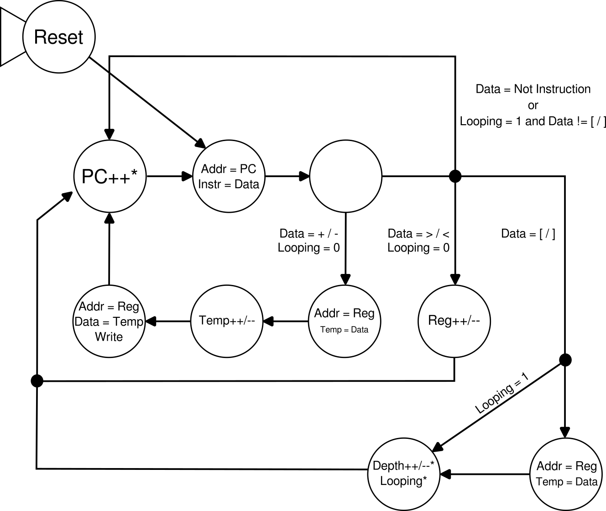
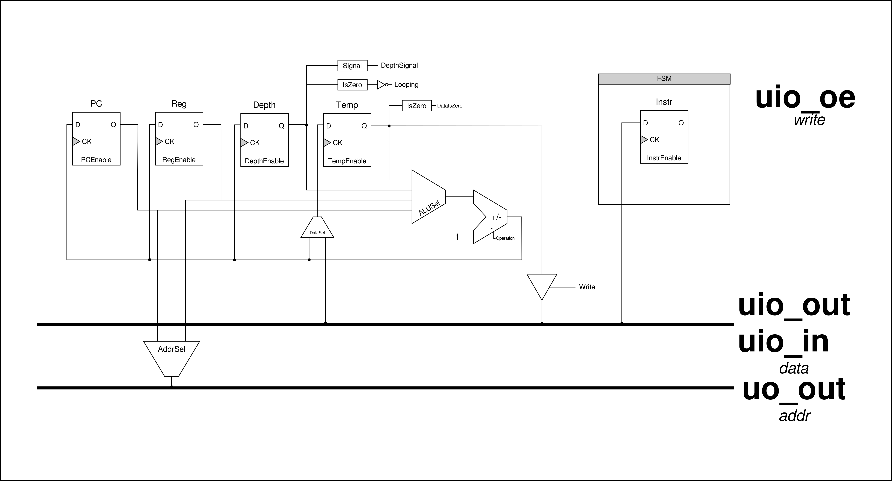
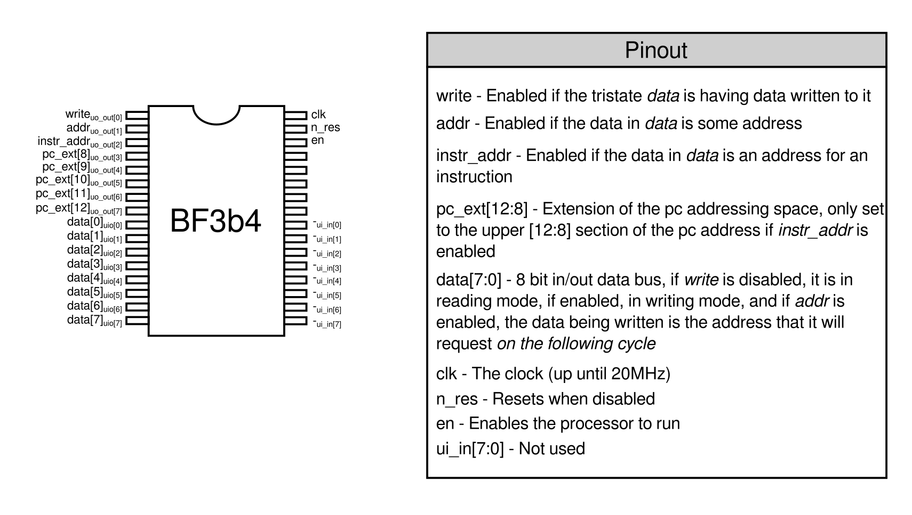

<!---

This file is used to generate your project datasheet. Please fill in the information below and delete any unused
sections.

You can also include images in this folder and reference them in the markdown. Each image must be less than
512 kb in size, and the combined size of all images must be less than 1 MB.
-->

## How it works

This is a 75% implementation (the IO operations of `.` and `,` weren't implemented) of the esoteric language [Brainfuck](https://en.wikipedia.org/wiki/Brainfuck) as small factor processor.
It works as any "regular" microprocessor would, executing the given ASCII values of each character as an opcode, following this state machine:

With an internal implementation close to the following one:

## How to test

This circuit has the following pinout:

To drive it, you need to have an external address register, as it requests reads/writes data in alternating cycles, some memory organization to support, at the minimum, 256 x 8 of program memory and 256 x 8 of instruction memory (this can be expanded until 1KB memories by also using the _pc_ext_ pins), and a clock, preferably at 20MHz. If you don't want for the program to access instruction memory, the pin _instr_addr_ is only set if the address being requested is for instructions, so you can use that to avoid it.

## External hardware

These are some components that you can use for interfacing with the processor:
- 256 x 8 SRAM
- 8 bits to 13 bits Register 
- 256 x 8 to 1K x 8 ROM 
- LED bars with 8 segments to show the current value exiting the processor on the data bus (_uio_out_)
