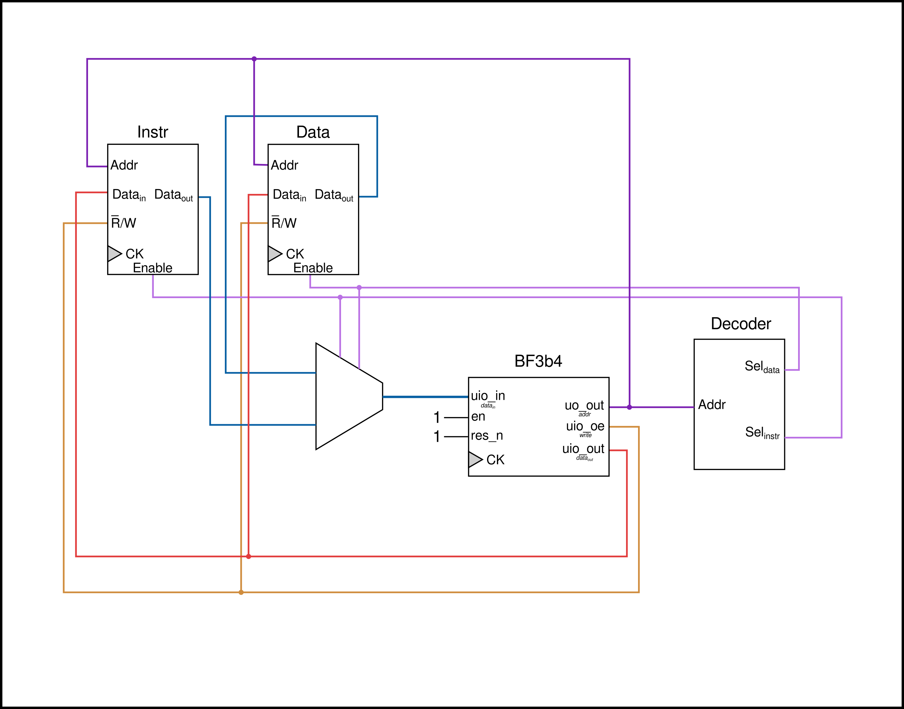

<!---

This file is used to generate your project datasheet. Please fill in the information below and delete any unused
sections.

You can also include images in this folder and reference them in the markdown. Each image must be less than
512 kb in size, and the combined size of all images must be less than 1 MB.
-->

## How it works

This is a 75% implementation (the IO operations of `.` and `,` weren't implemented) of the esoteric language [Brainfuck](https://en.wikipedia.org/wiki/Brainfuck) as small factor processor.
It works as any "regular" microprocessor would, executing the given ASCII values of each character as an opcode, following this state machine:

With an internal implementation close to the following one:

## How to test

This project can be tested by having a way to decode the address (_uo_out_) for instruction and data memory elements, and having their inputs and outputs correctly multiplexed for the data bus (_uio_in_ and _uio_out_), some way to visualize the output in each data memory location, and loading the instruction memory with valid brainfuck code binary (the ASCII of each character), as examplified in the following diagram:

(The elements are very generic on porpuse, they are just to give a general idea of how to interface with the processor)

## External hardware

These are some components that you can use for interfacing with the processor (imagining a structure where half of the memory is for instruction only memory, and half for the RAM):
- 256 x 8 SRAM
- 256 x 8 ROM
- LED bars with 8 segments to show the current value exiting the processor on the data bus (_uio_out_) and address (_ou_out_)
