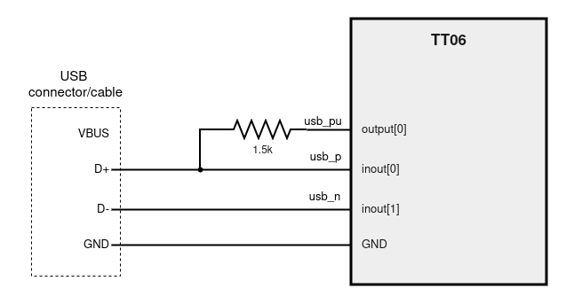
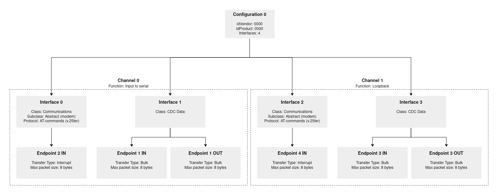

<!---

This file is used to generate your project datasheet. Please fill in the information below and delete any unused
sections.

You can also include images in this folder and reference them in the markdown. Each image must be less than
512 kb in size, and the combined size of all images must be less than 1 MB.
-->

## How it works

The design works as Full Speed (12Mbit/s) USB communications device class (or USB CDC class). It implements the Abstract Control Model (ACM) subclass.  
Most of the code is based on this repo: https://github.com/ulixxe/usb_cdc

When connected to a pc the device should appear as two virtual serial ports. (COMX on Windows, /dev/ttyACMx on Linux and /dev/cu.usbmodemxxxx on OSX)  
(Linux requires that the user account belongs to the dialout group to grant permissions for virtual COM access)

Each port/channel has a different application:

### USB CDC Channel 0 
Application: Input to serial  
Description: When the value from one of the inputs change from 0 to 1 or 1 to 0 it sends a character to the port.  
USB Interfaces: 0 and 1  
USB Endpoints: EP2 (IN, INTERRUPT), EP1 (IN, BULK), EP1 (OUT, BULK)  


pin/character relation:
| pin | rise | fall |
| --- | ---- | ---- |
|input[0] | A | a |
|input[1] | B | b |
|input[2] | C | c |
|input[3] | D | d |
|input[4] | E | e |
|input[5] | F | f |
|input[6] | G | g |
|input[7] | H | h |

### USB CDC Channel 1
Application: Loopback  
Description: Simple loopback application to test the port. Every character sent shall return.  
USB Interfaces: 2 and 3  
USB Endpoints: EP4 (IN, INTERRUPT), EP3 (IN, BULK), EP3 (OUT, BULK)  


### Port identification
There's no warranty that the ports are going to be named in that order (not sure on Linux, on Windows they definitely can have the order reversed).
Without any extra OS functions, the simple way to identify them is to open one of the ports and write something to it. If you are connected to the Channel 1 loopback you should receive the same char as response.


## External hardware

USB cable with internal cables exposed or USB connector + USB cable  
1.5k resistor  
Computer 

Optional:  
Buttons for the inputs or use the TT demo board switches


## How to test

TT board clock needs to be set to 48MHz

Basic schematic:  



Cut output[0] LED display jumper on TT board? I haven't been able to test if this is necessary or not. 

Once the USB cable is connected to the PC two virutal serial ports should be available to communicate: COMX on Windows, /dev/ttyACMx on Linux and /dev/cu.usbmodemxxxx on OSX  
Linux requires that the user account belongs to the dialout group to grant permissions for virtual COM access. You can change udev rules to fix that or add the user to the group by running: `sudo usermod -a -G dialout $USER` and restart

Example connection on Linux using picocom:  
`picocom /dev/ttyACM0`  or `picocom /dev/ttyACM1`  


## Extra information 

### USB Interfaces/Endpoints:


The device has USB vendor ID and product **ID = 0000**

### Useful scripts
On the project repo there are some Linux scripts to get information about the USB devices:  
- `list_usb_devices.sh`
  - list all USB devices connected. Look for ID 0000:0000 
- `list_device_0000_0000.sh`
  - detailed USB descriptors configuration of device 0000:0000 

This is how the device should look with the `lsusb -tv` or `list_usb_devices.sh` command:
```
    |__ Port 1: Dev 42, If 2, Class=Communications, Driver=cdc_acm, 12M
        ID 0000:0000  
    |__ Port 1: Dev 42, If 0, Class=Communications, Driver=cdc_acm, 12M
        ID 0000:0000  
    |__ Port 1: Dev 42, If 3, Class=CDC Data, Driver=cdc_acm, 12M
        ID 0000:0000  
    |__ Port 1: Dev 42, If 1, Class=CDC Data, Driver=cdc_acm, 12M
        ID 0000:0000  
```

For deeper debugging and understanding of the USB protocol exchange between the device and the PC *Wireshark* app can be used

### Debug pins:

These are the extra pins used for development debugging:
| port | name | description |
| --- | ---- | ---- |
|output[1] | "debug_led" | once configured lights aprox. once per second|
|output[2] | "debug_usb_configured" | USB configured on PC|
|output[3] | "debug_usb_tx_en" | inout[0] and inout[1] as outputs|
|output[4] | "debug_frame[0]" | USB frame number binary digit 0|
|output[5] | "debug_frame[1]" | USB frame number binary digit 1|
|output[6] | "debug_frame[2]" | USB frame number binary digit 2|
|output[7] | "debug_frame[3]" | USB frame number binary digit 3|


### Some USB information resources:
- USB in a NutShell:
  - https://www.beyondlogic.org/usbnutshell/usb1.shtml
- USB Made Simple
  - https://www.usbmadesimple.co.uk/index.html
- Understanding the Universal Serial Bus (USB)
  - https://github.com/DCC-Lab/PyHardwareLibrary/blob/939ffca7c8b3b214b77acadae2d76d5029dd0660/README-1-USB.md
- USB Device CDC ACM Class
  - https://docs.silabs.com/protocol-usb/1.2.0/protocol-usb-cdc/