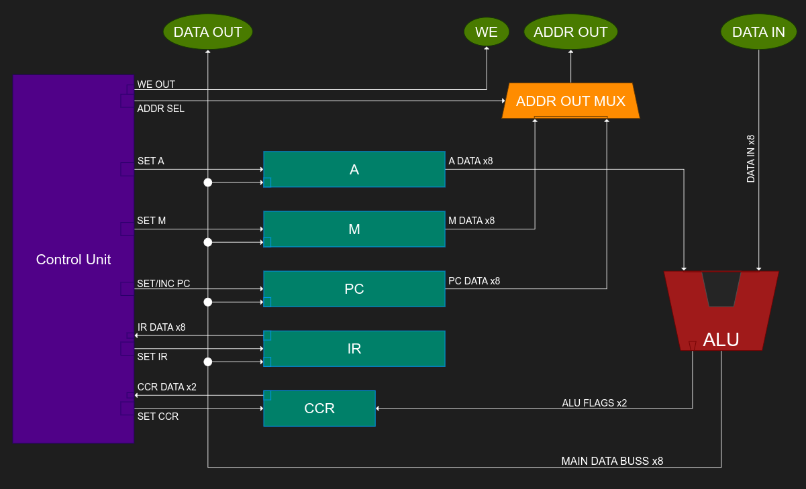
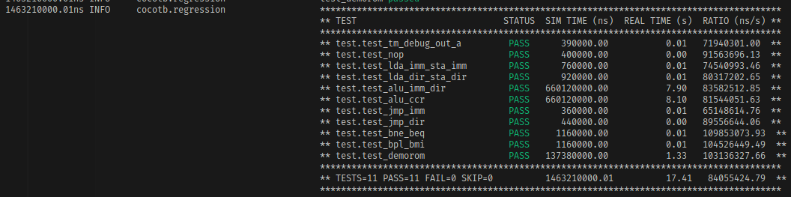
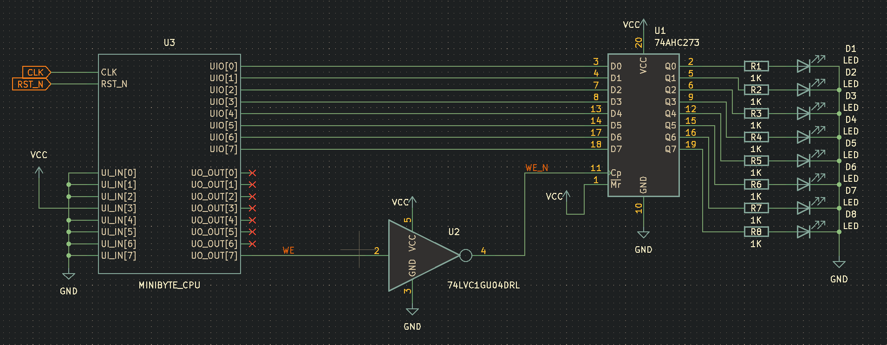
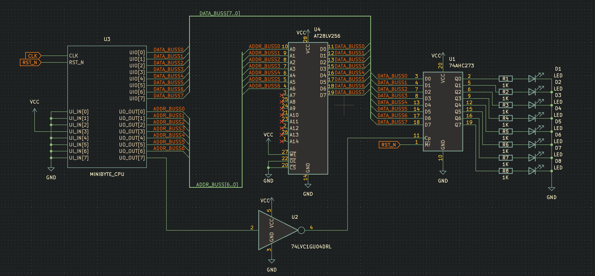

<!---

This file is used to generate your project datasheet. Please fill in the information below and delete any unused
sections.

You can also include images in this folder and reference them in the markdown. Each image must be less than
512 kb in size, and the combined size of all images must be less than 1 MB.
-->

## How it works

The Minibyte CPU is a simple "toy" 8-bit CPU that uses a custom RISC instruction set

The CPU also has some built in DFT (Design For Test) features and a Demo ROM that can be enabled for easy testing

This was created mostly as a learning/reference project to get more familiar with Verilog

At some point between tapeout and silicon arriving, I intend to write a rudimentary assembler for creating programs that can be burned to EPROM/EEPROMs to be used with the CPU. Please monitor the main github repo for this project for eventual details.

### Specs

    Max CLK Frequency: 50Mhz (untested)

    Data Buss Width:    8 bits
    Address Buss Width: 8 bits (only 7 bits usable due to limited IO)

    Registers:
        A   - 8 bits wide - Accumulator
        M   - 8 bits wide - Memory Address Pointer
        PC  - 8 bits wide - Program Counter
        IR  - 8 bits wide - Instruction Register
        CCR - 2 bits wide - Condition Code Register

    Number of Instructions: 37

    ALU:
        Data Inputs: 2x 8 bit inputs
        Data Output: 8 bits (result) + 2 bits (flags)

        Operations Supported:
            PASSA - Passthrough input A
            PASSB - Passthrough input B
            ADD   - Add A and B
            SUB   - Subtract B from A
            AND   - Logical and of A, B
            OR    - Logical or of A, B
            XOR   - Logical xor of A, B
            LSL   - Logical shift A left by B
            LSR   - Logical shift A right by B
            ASL   - Arithmetic shift A left by B
            ASR   - Arithmetic shift A right by B
            RSL   - Rotary shift A left by B
            RSR   - Rotary shift A right by B

        Flags:
            Z - Set if the ALU result is zero, otherwise clear
            N - Set if the ALU result is a negative 8 bit signed int, otherwise clear

### Pinout

    uio[7:0]    - DATA IN/OUT BUSS
    ui_in[7:0]  - DFT Testmode Select
    uo_out[7]   - WE (Write Enable Signal)
    ou_out[6:0] - ADDR OUT BUSS

### Architecture

The Minibyte CPU uses a very traditional register architecture where most data is manipulated via a single accumulator (A Register)

The ALU operates on data from the A Register and either direct data from memory (indexed by the M register), or immediate data from the current instruction's operand (indexed by the PC register)

*Note that DFT and testing features are not represented in the above block diagram

### Power Up State

Upon reset, the device will be initialized with all registers cleared out to 0. This included the program counter (PC register). It is expected that the program memory will start at address 0x00 to begin execution.

### Instruction Set

The Minibyte CPU has 4 format types for its instructions. The instruction memory is chunked into bytes, with some instructions only occupying a single byte, while others consume 2 bytes for an opcode and a following operand

| Type               | Length      | Desc |
| ------------------ | -------     | ------- |
| Inherent           | 8 - bits    | IR with no operand |
| Immediate          | 16 - bits   | IR with an operand containing DATA |
| Direct             | 16 - bits   | IR with an operand containing an ADDRESS |
| Indirect           | 16 - bits   | IR with an operand containing an ADDRESS that points to another ADDRESS |

As a visual reference, here is how we would expect a basic program to look in memory. Please note that all programs start executing from address 0x00 as shown.

This program adds the numbers 0x05 and 0x03 together, and then loops back to the starting IP of 0x00

#### Inherent IR:

| Type                  | OP[7:0]   |
| --------------------- | -------   |
| Inherent              | IR OPCODE |

#### Immediate/Direct IR:

| Type               | OP[15:8]  | OP[7:0]          |
| ------------------ | -------   | -------          |
| Immediate          | IR OPCODE | OPERAND DATA     |
| Direct             | IR OPCODE | OPERAND ADDRESS  |
| Indirect           | IR OPCODE | OPERAND ADDRESS  |

####

#### Opcode Table

| OPCODE     | HEX   | Operand   | CCR      | Desc                                                                               |
| ---------- | ----- | --------- | -------- | ---------------------------------------------------------------------------------- |
| NOP        | 0x00  | N/A       | N/A      | No Operation                                                                       |
| LDA_IMM    | 0x01  | Immediate | N/A      | Load A with immediate operand data                                                 |
| LDA_DIR    | 0x02  | Direct    | N/A      | Load A with the data stored at the operand address                                 |
| STA_DIR    | 0x03  | Direct    | N/A      | Store A at the operand address                                                     |
| STA_IND    | 0x04  | Indirect  | N/A      | Store A at the address contained at the operand address                            |
| ADD_IMM    | 0x05  | Immediate | N/A      | Add the immediate operand data to A                                                |
| ADD_DIR    | 0x06  | Direct    | N/A      | Add the data stored at the operand address to A                                    |
| SUB_IMM    | 0x07  | Immediate | N/A      | Subtract the immediate operand data from A                                         |
| SUB_DIR    | 0x08  | Direct    | N/A      | Subtract the data stored at the operand address from A                             |
| AND_IMM    | 0x09  | Immediate | N/A      | And the immediate operand data with A                                              |
| AND_DIR    | 0x0A  | Direct    | N/A      | And the data stored at the operand address with A                                  |
| OR_IMM     | 0x0B  | Immediate | N/A      | Or the immediate operand data with A                                               |
| OR_DIR     | 0x0C  | Direct    | N/A      | Or the data stored at the operand address with A                                   |
| XOR_IMM    | 0x0D  | Immediate | N/A      | Xor the immediate operand data with A                                              |
| XOR_DIR    | 0x0E  | Direct    | N/A      | Xor the data stored at the operand address with A                                  |
| LSL_IMM    | 0x0F  | Immediate | N/A      | Logical shift A left by the immediate operand data                                 |
| LSL_DIR    | 0x10  | Direct    | N/A      | Logical shift A left by the data stored at the operand address                     |
| LSR_IMM    | 0x11  | Immediate | N/A      | Logical shift A right by the immediate operand data                                |
| LSR_DIR    | 0x12  | Direct    | N/A      | Logical shift A right by the data stored at the operand address                    |
| ASL_IMM    | 0x13  | Immediate | N/A      | Arithmetic shift A left by the immediate operand data                              |
| ASL_DIR    | 0x14  | Direct    | N/A      | Arithmetic shift A left by the data stored at the operand address                  |
| ASR_IMM    | 0x15  | Immediate | N/A      | Arithmetic shift A right by the immediate operand data                             |
| ASR_DIR    | 0x16  | Direct    | N/A      | Arithmetic shift A right by the data stored at the operand address                 |
| RSL_IMM    | 0x17  | Immediate | N/A      | Rotate A left by the immediate operand                                             |
| RSL_DIR    | 0x18  | Direct    | N/A      | Rotate A left by the data stored at the operand address                            |
| RSR_IMM    | 0x19  | Immediate | N/A      | Rotate A right by the immediate operand data                                       |
| RSR_DIR    | 0x1A  | Direct    | N/A      | Rotate A right by the data stored at the operand address                           |
| JMP_DIR    | 0x1B  | Direct    | N/A      | Jump PC to the address specified by the operand                                    |
| JMP_IND    | 0x1C  | Indirect  | N/A      | Jump PC to the address stored at the operand address                               |
| BNE_DIR    | 0x1D  | Direct    | Z==CLEAR | Jump PC (if ALU z flag is clear) to the address specified by the operand           |
| BNE_IND    | 0x1E  | Indirect  | Z==CLEAR | Jump PC (if ALU z flag is clear) to the address stored at the operand address      |
| BEQ_DIR    | 0x1F  | Direct    | Z==SET   | Jump PC (if ALU z flag is set) to the address specified by the operand             |
| BEQ_IND    | 0x20  | Indirect  | Z==SET   | Jump PC (if ALU z flag is set) to the address stored at the operand address        |
| BPL_DIR    | 0x21  | Direct    | N==CLEAR | Jump PC (if ALU n flag is clear) to the address specified by the operand           |
| BPL_IND    | 0x22  | Indirect  | N==CLEAR | Jump PC (if ALU n flag is clear) to the address stored at the operand address      |
| BMI_DIR    | 0x23  | Direct    | N==SET   | Jump PC (if ALU n flag is set) to the address specified by the operand             |
| BMI_IND    | 0x24  | Indirect  | N==SET   | Jump PC (if ALU n flag is set) to the address stored at the operand address        |

### DFT Features

The Minibyte CPU has a few DFT features that should prove helpful on live silicon debug/testing. All functions are enabled by an active high signal, so ui_in[7:0] should be tied to zero during normal operation

| ui_in Bit   | Feature                         |
| ---------   | -------                         |
| ui_in [7:5] | Unused                          |
| ui_in [4]   | Enable Demo ROM                 |
| ui_in [3]   | Halt Control Unit on Next Fetch |
| ui_in [2:0] | Debug Out Select                |

The CPU has an extra mux between the normal addr out mux and the uo_out pins. To leverage this ui_in [2:0] can be used to select a debug signal to output on the uo_out[6:0] pins.

| Debug Out Select    | Function                            |
| ---------           | -------                             |
| ui_in[2:0] = 0b000  | Normal Operation                    |
| ui_in[2:0] = 0b001  | Output A[6:0] to uo_out[6:0]        |
| ui_in[2:0] = 0b010  | Output A[7] to uo_out[0]            |
| ui_in[2:0] = 0b011  | Output M[6:0] to uo_out[6:0]        |
| ui_in[2:0] = 0b011  | Output PC[6:0] to uo_out[6:0]       |
| ui_in[2:0] = 0b011  | Output IR[6:0] to uo_out[6:0]       |
| ui_in[2:0] = 0b011  | Output CCR[1:0] to uo_out[1:0]      |
| ui_in[2:0] = 0b011  | Output CU_STATE[6:0] to uo_out[6:0] |

## How to test

### Simulation

The Minibyte CPU has fairly exhaustive cocotb test suite that is able to test and verify most of the device's intended functionality.

To run the test suite, cd into the ./test directory of the project and run "make"

### On Live Silicon

The easiest way to test the Minibyte CPU on live silicon is to use the built-in Demo ROM

To enable the Demo ROM, make sure that ui_in[4] is held high on reset, and remains high while the program runs

The Demo ROM will run the following program

    PSEUDOCODE:
        WHILE FOREVER{
            SET A to 0

            WHILE A <= 255 {
                INCREMENT A

                WRITE A to ADDRESS 0x40
            }

            SET A to 1

            WHILE A > 0 {
                LEFT SHIFT A by 1

                WRITE A to ADDRESS 0x40
            }
        }

To capture the output of the program with LEDs, it is recommended to add a D-Flip Flop (such as a 74x273 series chip) on the output of the data buss (uio[7:0]). See External Hardware section below for more details

## External hardware

### Demo Setup

Something like the above schematic is recommended to run the Demo ROM. Note that we should use an inverter (like a 74x04 series chip) as shown on the CLK of the DFF, as we want data to be latched when WE falls back to 0 (after the data has had time to set up and make its way out of the chip). Please also note that you will probably need to run the CPU at a fairly low CLK frequency in order to see any LED activity with the naked eye.

### Other Setups

The sky is the limit as far as as what devices you attach to the CPU. If you are writing your own programs, you probably are going to want to attach some sort of external ROM to the main address and data buss. Here is a recommended setup to add an external EEPROM to the demo setup so that you can test your own programs.

Beyond this, you will hopefully find that the Minibyte CPU can be paired with a wide variety 3.3V compatible parallel ROM/EPROM/EEPROM, SRAM, and IO expander modules.

