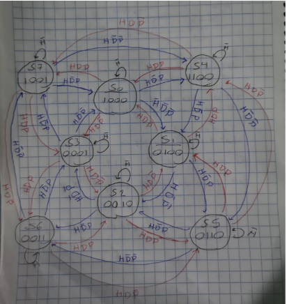
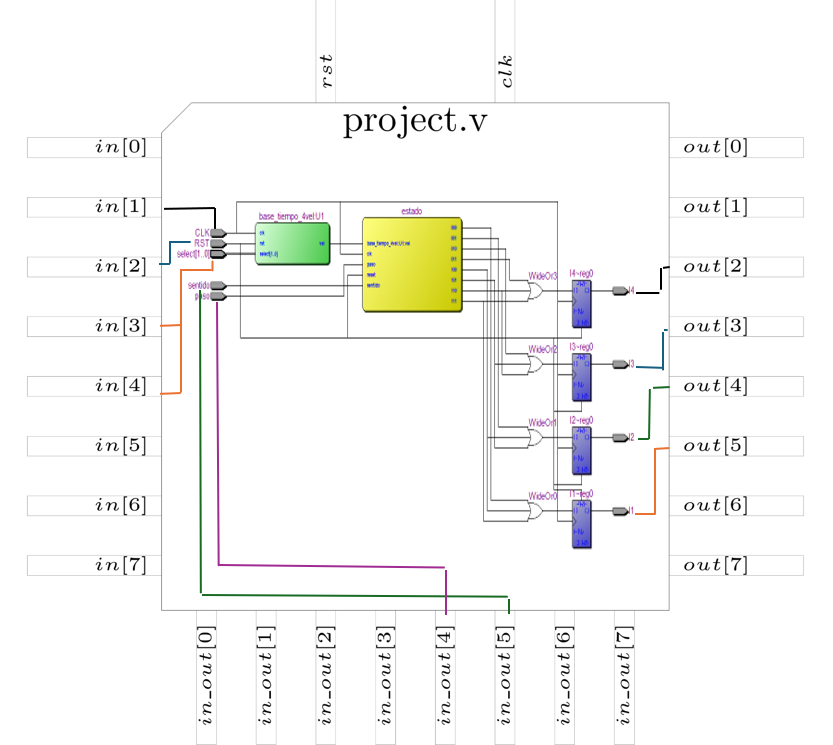
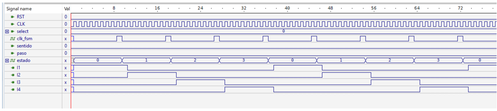
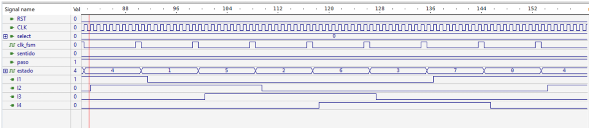
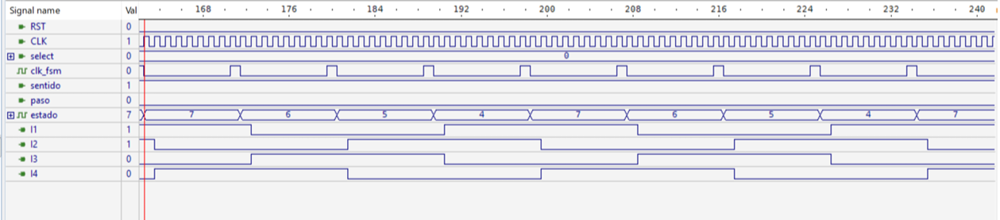
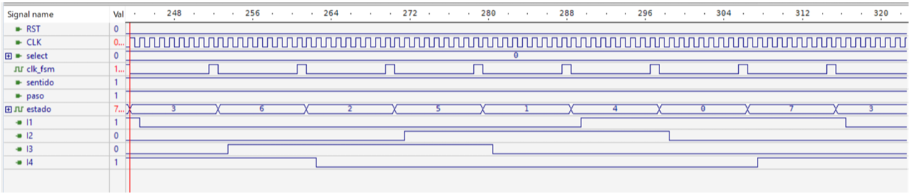
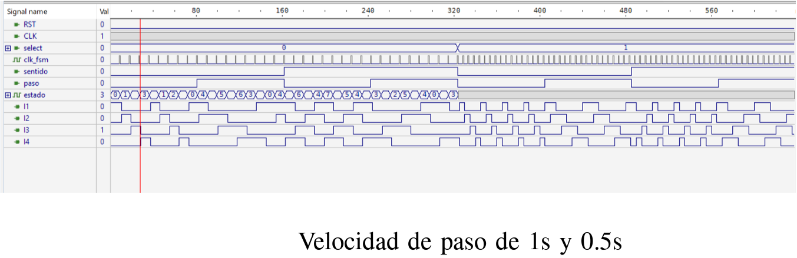
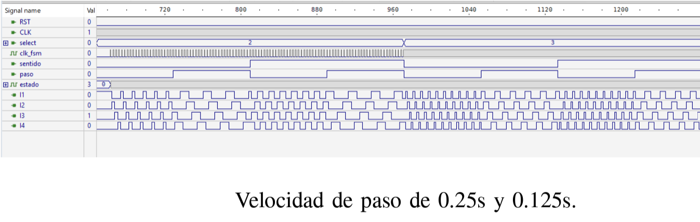

<!---

This file is used to generate your project datasheet. Please fill in the information below and delete any unused
sections.

You can also include images in this folder and reference them in the markdown. Each image must be less than
512 kb in size, and the combined size of all images must be less than 1 MB.
-->

## How it works

En este trabajo se realiza un motor a pasos con la implementación de una máquina de estados tipo moore. El cambio de un estado a otro se hace a diferentes velocidades, 1s, 0.5s, 0.25s y 0.125s, utilizando la base de tiempo realizada en el trabajo anterior. Se realizan 3 tipos de pasos para este motor los cuales son el paso completo, el medio paso y el paso doble y cada uno de estos puede ser realizado en el sentido horario o antihorario.

El motor a pasos puede implementarse como una máquina de estados en la cual tendremos 3 entradas y 4 salidas. Las entradas son :

  -Selector de velocidad: Viene de una base de tiempo previamente realizada. En el código puede verse como un wire llamado vel. Si está en un valor alto se            cambia al siguiente estado mientras que en un valor bajo se mantiene en el mismo estado. Con esta entrada podemos variar la velocidad con la que cambian los        estados.
  
  -Sentido: Esta entrada indica si el motor a pasos tendrá el sentido antihorario u horario, en el código esta representada por la entrada sentido.

  -Paso: Con esta entrada definimos si el paso será completo, medio o doble. En el código se define como paso.

Las 4 bobinas de salidas se definen como I1, I2, I3 y I4.
En la figura podemos ver el diagrama de la maquina de estados que representa al motor a pasos. La entrada H corresponde a la salida de la base de tiempo vel, la salida D al sentido y P al tipo de paso.

En la siguiente figura se presentan las conexiones de las entradas y salidas de la máquina de estados con las correspondientes al chip del proyecto.
{width=70%}

Las entradas RST, select, sentido y paso son entradas que pueden ser controladas con un switch o push button ya que únicamente se requiere de un valor lógico alto o bajo para ellas. La entrada CLK corresponde al reloj, no se conecta al reloj del chip para poder tener más libertad en el valor de la frecuencia de la base de tiempo. Aunque originalmente se utilizó un reloj de 50MHz. Finalmente, las salidas I1, I2, I3 y I4 son las salidas de la máquina de estados. La frecuencia de operación de estas dependen del valor de la entrada select, ya que esta controla la velocidad del pulso de la base de tiempo que a su vez controla la velocidad a la que operara la máquina de estados (50MHz, 25MHz, 12.5MHz o 6.25MHz).

## How to test
Se utiliza un reloj de 50MHz para la máquina de estados y la base de tiempo. Dependiendo del selector de velocidad el cambio de un estado a otro se dará en 1s (cuando se cuenten todos los ciclos), 0.5s (conteo de la mitad de los ciclos), 0.25s (conteo de 1/4 del total de los ciclos) o 0.125s (1/8 de los ciclos). Si la entrada "paso" esta activa entonces el cambio será de medio paso y cuando este en bajo el paso será completo, si la entrada paso está en bajo y nos encontramos en un estado correspondiente a medio paso (4, 5, 6 o 7) entonces el paso será doble. Si la entrada "sentido" está en bajo entonces el cambio se dará en sentido horario y cuando la entrada este en un valor alto el sentido será antihorario. Por último, la salida de la base de tiempo nos indica si cambiar a otro estado (valor en alto) o permanecer en el mismo estado (valor en bajo).

Para la simulación se cambia el parámetro f de la base de tiempo de 50000000 a 8 para facilitar la simulación. La señal de reset se deja en el valor fijo 0, el reloj tiene un periodo de 1ns, el select y el sentido se establecen con un periodo de 324ns y el paso con 162ns. De esta manera podemos ver todas las combinaciones para las entradas sentido y paso con una sola velocidad. En la figura se observan las salidas correspondientes a cada estado con el sentido horario (sentido=0) y el paso completo (paso=0).

los estados cuando el sentido es horario (sentido=0) y se tienen medios pasos (paso=1) se tienen en la siguiente imagen 

La imagen de abajo muestra la combinación de entradas correspondientes a un sentido antihorario (sentido=1) y ya que el paso es completo entre los estados 4 al 7 se considera un paso doble (paso=0).

En la próxima imagen se regresa al medio paso (paso=1) pero ahora en sentido antihorario (sentido=1).

Finalmente, tenemos los diferentes valores que puede tomar el selector de velocidad (1s, 0.5s, 0.25s y 0.125s). Para cada caso las salidas son las mismas pero con una frecuencia más alta en comparación a la anterior.

## External hardware

FPGA Cyclone II EP2C35F672C6ES
