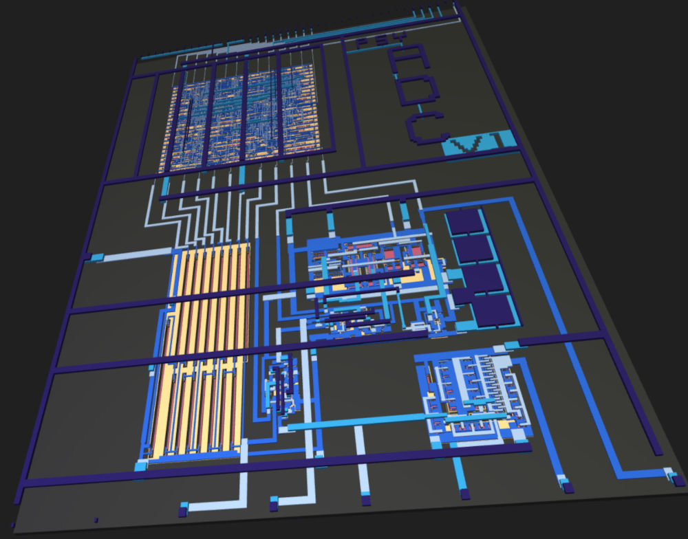
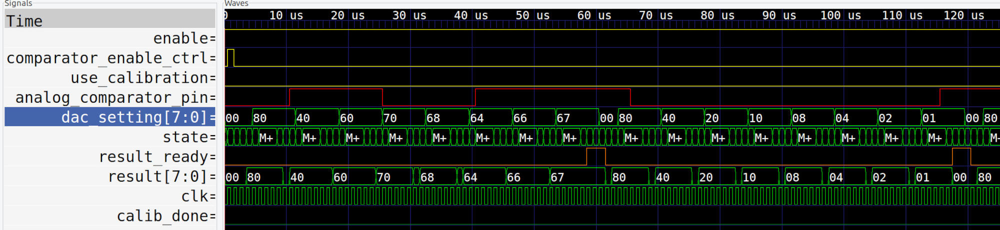
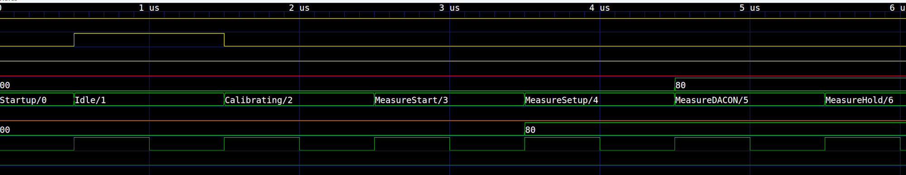
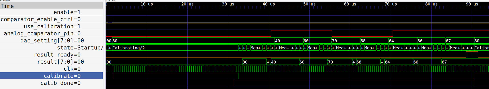
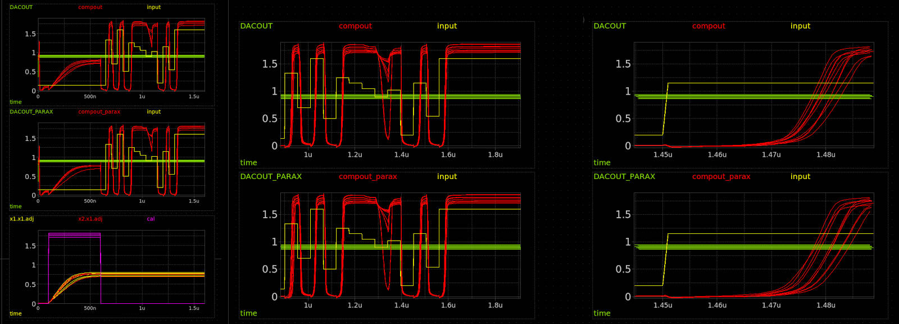
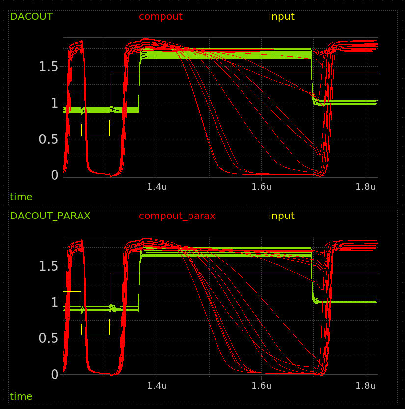
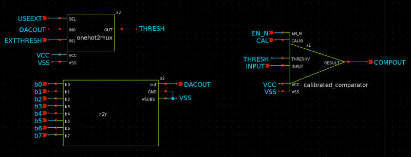
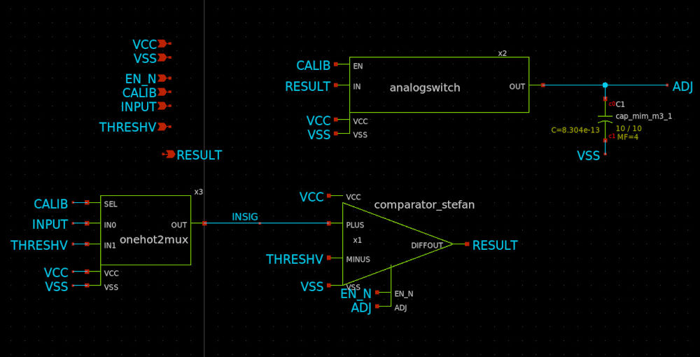
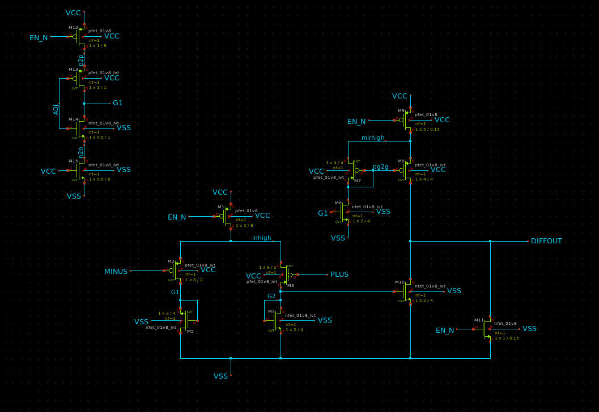

<!---

This file is used to generate your project datasheet. Please fill in the information below and delete any unused
sections.

You can also include images in this folder and reference them in the markdown. Each image must be less than
512 kb in size, and the combined size of all images must be less than 1 MB.
-->

## How it works

This project is a mixed signal design that glues together a few bits to create a simple ADC.  It uses

  * An analog comparator, based on the design done by Stefan Schippers in [Analog schematic capture and simulation](https://www.youtube.com/watch?v=q3ZcpSkVVuc), re-captured in xschem and laid out with magic;
  
  * The analog blob from the R2R DAC in [Matt Venn's R2R DAC TT06 submission](https://github.com/mattvenn/tt06-analog-r2r-dac);
  
  * A digital signal processor and front end, created using Amaranth; and
  
  * A few analog switches and a 2:1 analog mux, created and laid out for the project.
  
While at it, I also laid out a version of the [p3 opamp from this project](https://github.com/argunda/tt06-tiny-opamp) and embedded it in for testing purposes.

The ADC uses the DAC to set the threshold on the comparator and see what it says about the input signal--is it higher or lower--to perform a search and hone in on a digital value to output.  Doing it in this way, it manages to determine a value in about 60 clock cycles ).

The analog output of the comparator, R2R DAC and p3 opamp are all provided through analog pins for testing and experimentation.

A few options are available:

  * The system can perform a comparator calibration before each reading (which increases the processing time but should make things more reliable).  Enable this by holding the enable calibrations pin high;
  
  * Rather than feed the R2R DAC output to the comparator, it can receive input from an analog pin instead.  Set "use external threshold" input pin HIGH for this, and feed into appropriate analog pin.

### Internals

Some details about how it's built...

### Digital 
With no calibration enabled, it takes about 60 clock cycles to get a valid result

In the above, there is a simulated analog comparator output (in red). The DAC is setting each bit, starting with the high bit, in turn.  If the comparator says HIGH when the output is checked, it means that the input voltage is higher than what we're comparing to so that bit is preserved. Each bit is set, if the comparator is low when we check, that bit is cleared from the eventual result.  When we reach the LSB, the result ready signal goes high--it's held that way for 3 clocks. Then the process repeats.

This all works with an FSM that goes through multiple steps, zoomed in here:

For simplicity, we alway pass through the calibrating state, though it only lasts a single clock cycle when the use_calibration pin is low.

For things to work, the comparator does need some calibration, at least sometimes.  How often?  I don't know yet.  When use_calibration is high, the cycle has a period at the start where:

 * the DAC is set mid-range
 
 * the comparator receives the same input on both inputs and is put into calibrate mode 
 
 
 

This actually charges up a capacitor internally which is used to adjust the comparator output.  Because this takes a finite amount of time, which was found to be around 400ns for reliable operation in simulation, I gave it 28 clock cycles of calib time to support a theoretical clock of up to 70MHz.

Using a conservative 50MHz clock, this means that readings can be done in about 1.75 microseconds with calibration, and 1.2 us without.  Assuming we need to cal every 3 samples, this gives the ADC a throughput of around 720k samples per second, or more than 560ksps if you want to keep it simple and calibrate before every measurement, on a 50MHz clock.

These are _theoretical_ maxima, of course.  I haven't even tried to drive things this fast in sim, though that is planned.

And this is for the digital side only.  From the analog side, a lot depends on the comparator (more below).  Short version is that it can react quite quickly.

Here's a sim of the full analog side, looking at the comparator (a number of runs, gaussian distribution of temperatures):

Green is the threshold we're comparing to (DAC output), yellow is the input signal (so clean), and red is the comparator output.  On the left, you can see the whole sequence including a calibration step at the beginning.

Things get a little fuzzy when the input is very close to the threshold, but otherwise you can see the comparator does a good job comparing, and reacts quickly too.  About 40 nanoseconds after the input goes above the threshold: bam, comparator is logic HIGH, even in the worst cases.

So we're talking being able to deal in the tens of MHz for this wonderful circuit.

However I did find some instances, like here where I suddenly set the DAC above the input (so comparator should go low):

That's not pretty.  Suddenly we're looking at 200-400ns sometimes.  Ok, so let's revise that down to the low single digit MHz.   Say we always want to leave 400ns before sampling the comparator output, well it'll take us 3.2us To get a full byte of comparisons, so we're down to 312ksps.  I'd be ok with that.

A final  *however* on this front: if we really want 400ns for things to settle after the DAC is set, the digital side has 4 clock cycles between setting the DAC value, and the cycle when it actually captures the compator output.  I think that means we'd have to clock at 10MHz, thereby reducing our best effective max sample rate to 144ksps -- booo.  Ok, not that bad if it actually works and I am being quite conservative (hopefully) with that 400ns settle time.

### Analog

The analog side of things is at the service of the digital.  The main ADC block is 

The r2r DAC is simply controlled using 8 bits, the end.  Its output goes to a 2:1 analog mux--called one-hot here because I intended to make 4:1 and maybe other versions that'd just be one-hot but that's for later.

External input goes to one side of the comparator, and the output of this mux goes to the other -- that lets us send either the DAC output or whatever's coming in from an external pin to the other side for comparison.

That calibrated comparator has a CAL input.  That's because, inside of that symbol is this:

Another mux and and analog switch, in addition to the comparator.  That lets us choose between sending the input or the threshold to the plus side of the comparator.  Sending the threshold to both inputs of the comparator seems useless, but that only happens when CALIB is HIGH, which also trips the analog switch and pipes the output of the comparator to the capacitor and the adjust pin on said comparator.  This is why it's a *calibrated* comparator: Hold CALIB high for a little bit, and the results come out looking a lot better.

Finally, inside that triangle is the actual comparator circuit, which I re-did watching a [video](https://www.youtube.com/watch?v=q3ZcpSkVVuc) of [Stefan Schippers](https://github.com/StefanSchippers) teaching some xschem design.

It's a bunch of FETs doing FET things.

### TODO

Well, I should probably have put a sample-and-hold system in there--would've been easy with the analog switch and a cap... c'est la vie.

Also, I didn't know how big the digital side would turn out, so I went the route of premature optimization (the "route" of all evil), and just used the output result bits as my scratch for the DAC twiddling.  The upside is that we get to have a good look at what the DAC is actually doing.  The downside is that it's a bit noisy, you only get a valid result during the result_ready blip (which I actually stretched with an additional FSM state).

The analog and digital together are all LVS clean and the digital side is tested in sim and with formal verification methods (a bit), but I never got a full simulation at the gate level because I couldn't coax verilator into handling my python-generated verilog... caused a weird bug, close to deadline.  Too bad: fingers crossed.

Would be nice to have a mode to control the DAC manually.

I wasn't exactly certain how the digital reset side would behave--I got scared that I'd wind up with reversed logic and the demoboard holding everything in reset forever.  So I left it unconnected and sacrificed a digital in to be the new reset pin. Sadness.  But safe.  Just remember it needs to be connected, "right" (probably low to go but, yeah, not sure, hah).

More grounding, and try to get in some bypass/bulk (for tiny values of bulk) capacitance.  We don't get filler, so it's DIY I did not D.

Before all that: build up testbench, get full simulation working, see if it'll even be worth the wait and have something to compare to when it does come back in physical form.

## How to test

Bring enable comparator, and reset pin low (?), feed a target voltage (less than 1v8) into appropriate analog input pin, clock the device and watch the output bits on the digital side.

When result ready output pin pulses high, the output bits are a calculated result.

Seems like it will be safe to clock at 10MHz, maybe more, uncertain as of yet.

For your testing pleasure, there are addition inspection and manipulation ports through the analog pins.  These are

  * ua[0]: The raw output from the comparator at the core of the design
  
  * ua[1]: p3 opamp out
  
  * ua[2]: p3 opamp plus side
  
  * ua[3]: p3 opamp minus/ext threshold for comp
  
  * ua[4]: Analog input to ADC
  
  * ua[5]: A probe into Matt's R2R DAC output (internal threshold for comparator while running the ADC
  

So the ADC basically only needs you to feed a signal into ua4.  You can see it in operation through ua0 and ua5.  You can use the comparator ignoring the ADC function, by setting ui[3] (use external threshold, digital input) HIGH and feeding a threshold voltage to the comparator on ua3.

Finally, there's a whole opamp in there, designed by Sai, which I laid out and included as a second test of this design.  We'll be able to see if there's any measurable difference and play with opamps, which is fun.

## External hardware

Voltage source for analog input.  Some way to look at outputs, nominally through the RP2040 on the demoboard--will be writing a script for that.

