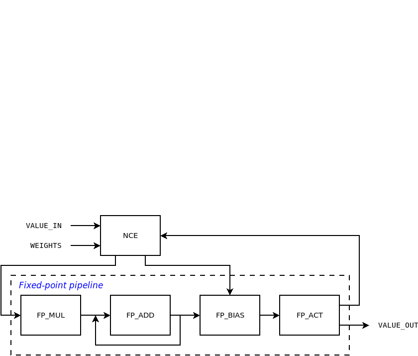
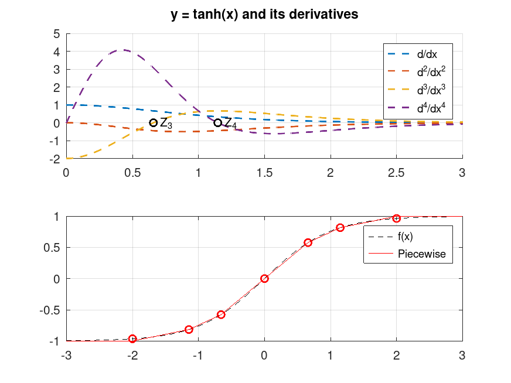
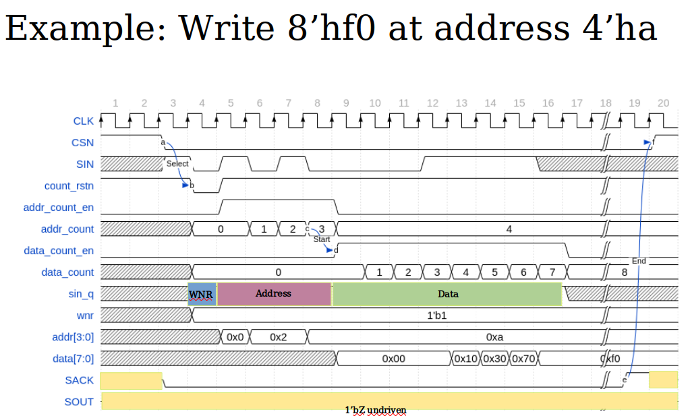
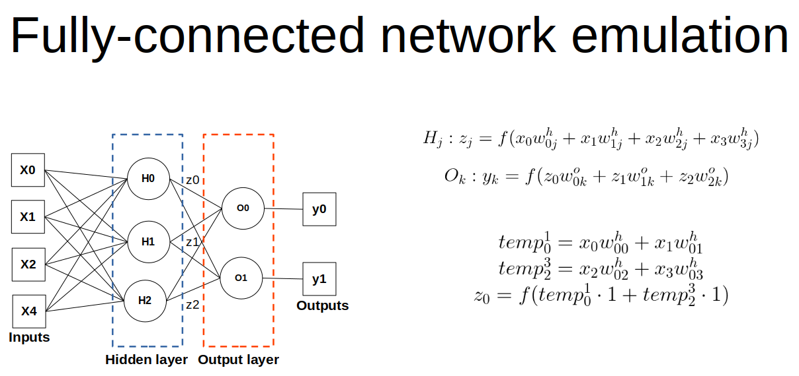
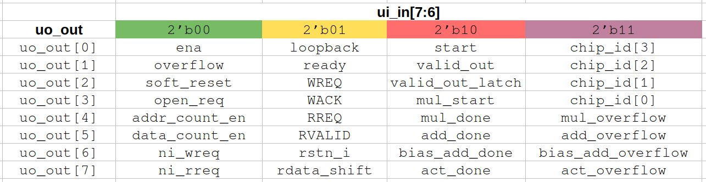

# GOA - grogu on ASIC
`GOA` stands for `grogu on ASIC`. It is a reduced version of the [CORTEZ
chip](https://github.com/scorbetta/CORTEZ) targeting the Tiny Tapeout 6 run. The `grogu` part comes
from the register file design utilities [grogu](https://github.com/scorbetta/grogu).

The `GOA` design is made of a single neuron with 2 (two) inputs. The register file contains a number
of registers for control and observation. The neuron core works on 8 (eight) bits fixed-point
arithmetic with 5 (five) reserved for the fraction.

# Neuron internals
The next figure shows the simplified block diagram of the Neuron.

The arithmetic pipeline is composed of a number of fixed-point units: multiplier, adder for
accumulator and bias, activation function. These primitives are shared, so that a centralized
control engine (`NCE`) dispatches one value at a time to the proper block. `WEIGHTS` matrix is
externally stored in a local register file, an instance of `grogu`.

The `NCE` expects exactly `NUM_INPUTS` input values. For each of them, the following process is
executed through the pipeline:

1. Multiply current value by its respective weight;
2. Accumulate the value.

Once all values have been received, bias is added and the non-linear activation function is used to
determine the output solution.

## Fixed-point
The entire pipeline works with fixed-point arithmetic. This reduces the complexity of the design.
For the Tiny Tapeout run, the fixed-point configuration is: 8 (eight) bits word with 5 (five) bits
reserved to the fractional part. All fixed-point operations wrap.

## Non-linear activation function
`tanh()` is the chosen non-linear activation function. Thanks to its mathematical properties, it is
interesting designing a fully digital filter that implements a piecewise approximation.

Linear interpolation between successive points is carefully chosen to minimize the error. The points
where the `tanh()` function is split are chosen by looking at up to the 4-th derivative. Since the
`tanh()` function is odd symmetric, the digital implementation focuses on half of the problem in the
1st quadrant. The other half of the problem on the 3rd quadrant is derived. The output is shown.

## Scalable Configuration Interface
The SCI interface has been designed for the `CORTEZ` chip to address dense register files with a
fairly large amount of registers. The SCI is designed to reduce wires and congestion. It consists of
an half-duplex communication mechanism with request/ack pairs, useful for low-speed peripheral
register access. Is is also latency insensitive. The SCI is inspired by the SPI protocol, with
tri-state bus and active-low chip select.

For the single neuron case, the SCI bus is not tri-stated, since there is one single peripheral.
This simplfies the implementation.

In general, the SCI interface for one Master and `N` Slaves is composed of 4 (four) signals (mapping
to the `tt_um_scorbetta_goa` pins is reported in the Pinout section).

| SIGNAL | WIDTH | DIRECTION | ROLE |
|-|-|-|-|
| `SCI_CSN` | `N` | Master-to-Slave | Active-low peripheral select |
| `SCI_REQ` | 1 | Master-to-Slave | Request |
| `SCI_RESP` | 1 | Slave-to-Master | Response |
| `SCI_ACK` | 1 | Slave-to-Master | Ack |

For detailed information on the SCI protocol please refer to [this page](TBD).

Examples of Write and Read accesses are shown.

## Network emulation
A twisted use of the single-neuron design can emulate an entire network made of a number of layers,
each with a number of neuron. This is doable thanks to the way the neuron is designed. Basically,
the 2-inputs neuron is repeadetely fed with iterative data, coming from either the external world
(i.e., input values) or intermediate results (i.e., from the inner core). Mathematically, the MAC
operation is distributed in time.

# Pinout
| PIN | DIRECTION | ROLE |
|-|-|-|
| `ui_in[0]` | input | FPGA clock |
| `ui_in[1]` | input | Active-low FPGA reset |
| `ui_in[2]` | input | Loopback data |
| `ui_in[3]` | input | Unused |
| `ui_in[4]` | input | Unused |
| `ui_in[5]` | input | Unused |
| `ui_in[6]` | input | Debug select [0] |
| `ui_in[7]` | input | Debug select [1] |
| `uo_out[0]` | output | Shared debug output dbug_out[0] |
| `uo_out[1]` | output | Shared debug output dbug_out[1] |
| `uo_out[2]` | output | Shared debug output dbug_out[2] |
| `uo_out[3]` | output | Shared debug output dbug_out[3] |
| `uo_out[4]` | output | Shared debug output dbug_out[4] |
| `uo_out[5]` | output | Shared debug output dbug_out[5] |
| `uo_out[6]` | output | Shared debug output dbug_out[6] |
| `uo_out[7]` | output | Shared debug output dbug_out[7] |
| `uio_in[0]` | input | SCI_CSN |
| `uio_in[1]` | input | SCI_REQ |
| `uio_out[2]` | output | SCI_RESP |
| `uio_out[3]` | output | SCI_ACK |
| `uio_out[4]` | input | Unused, configured as input |
| `uio_out[5]` | input | Unused, configured as input |
| `uio_out[6]` | input | Unused, configured as input |
| `uio_out[7]` | input | Unused, configured as input |

Debug signals are mapped to output pins `uo_out`. In total, 32 (thirty-two) signals are exposed to
the debug interface. Inputs `ui_in[7:6]` are used to control which ones, according to the following
table.

# Configuration
The configuration of the neuron is implemented by means of local registers that hold the values for
the weights and the bias. In addition, control registers are used to trigger the neuron operations.
All resigsters are 8 (eight) bits wide

| REGISTER | OFFSET | TYPE | CONTENTS |
|-|-|-|-|
| `WEIGHT_0` | 0x0 | R/W | Weight of input #0 |
| `WEIGHT_1` | 0x1 | R/W | Weight of input #1 |
| `BIAS` | 0x2 | R/W | Bias |
| `VALUE_IN` | 0x3 | R/W | Input value |
| `CTRL` | 0x4 | R/W | Control register |
| `STATUS` | 0x5 | R | Status register |
| `RESULT` | 0x6 | R | Neuron solution |
| `MULT_RESULT` | 0x7 | R | Intermediate multiplie result |
| `ADD_RESULT` | 0x8 | R | Intermediate adder result w/o bias |
| `BIAS_ADD_RESULT` | 0x9 | R | Intermediate adder result w/ bias |

# External hardware
The main clock `clk` is generated by the on-board RP2040 chip. It is used solely for debug purposes.
It is mirrored to `uo_out[1]`.

The core clock is instead drawn from `ui_in[0]`. This is generated by an FPGA residing on an
external board. `ui_in[0]` and `clk` are mesochronous, and they never interact.

The use of an external clock is required, since the SCI interface (also driven by the FPGA) needs
proper synchronization. The FPGA also drives the active-low core reset through `ui_in[1]`. All
control and status information is sent to and retrieved from the ASIC through the SCI interface.
