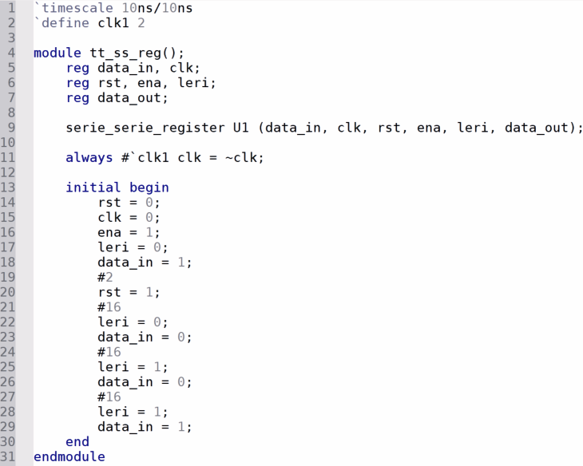

<!---

This file is used to generate your project datasheet. Please fill in the information below and delete any unused
sections.

You can also include images in this folder and reference them in the markdown. Each image must be less than
512 kb in size, and the combined size of all images must be less than 1 MB.
-->

## How it works

Se describe un registro Serie-Serie, con una terminal de entrada (data_in), terminales de control de reloj, reset negado y habilitación (clk, rst, ena). Se asigna una terminal para cambiar el tipo de corrimiento del registro (leri): ALTO para la izquierda y BAJO para la derecha. Se designa una salida del dato en el registro (data_out).

## How to test

Se coloca Rst en un valor BAJO, y el Ena en un valor ALTO. El flanco del reloj clk irá actualizando el valor de 4 registros internos que realizarán el corrimiento (data_reg) con el valor del dato de entrada (data_in). Del mismo modo, la entrada de dirección (leri) asignará la dirección del corrimiento y el bit del registro interno que se mostrará en la salida (data_out).

El diagrama que se presenta a continuación ilustra el RTL del circuito generado por Quartus II, se observa las entradas rst, clk y ena como las entradas básicas del circuito. Además se observa la entrada data_in como la entrada del dato, así como la entrada leri, que indica si el corrimiento del registro se realizará hacia la derecha (right) o hacia la izquierda (left). Del mismo modo se observa que el bit de entrada leri selecciona el bit que se considerará como el bit de salida data_out.

## External hardware

Se puede utilizar un generador de señales para el reloj (clk) y una base de tiempo para la habilitación (ena), así como botones o interruptores para las entradas y un led para visualizar la salida.
