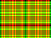
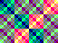
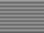

<!---

This file is used to generate your project datasheet. Please fill in the information below and delete any unused
sections.

You can also include images in this folder and reference them in the markdown. Each image must be less than
512 kb in size, and the combined size of all images must be less than 1 MB.
-->

## How it works

Modern GPUs use fragment shaders to determine the final color for each pixel. Thousands of shading units run in parallel to speed up this process and ensure that a high FPS ratio can be achieved.

Tiny Shader mimics such a shading unit and executes a shader with 10 instructions for each pixel. No framebuffer is used, the color values are generated on the fly. Tiny Shader also offers an SPI interface via which a new shader can be loaded. The final result can be viewed via the VGA output at 640x480 @ 60 Hz, although at an internal resolution of 64x48 pixel.

### Examples

These images and many more can be generated with Tiny Shader. Note, that shaders can even be animated by acessing the user or time register.

|||||
|-|-|-|-|
|||||

The shader for the last image is shown here:

```
# Shader to display a rainbow colored sine wave

# Clear R3
CLEAR R3

# Get the sine value for x and add the user value
GETX R0
GETUSER R1
ADD R0 R1

# Set default color to R0
SETRGB R0

# Get the sine value for R0
SINE R0
HALF R0

# Get y coord
GETY R1

# If the sine value is greater
# or equal y, set color to black
IFGE R1
SETRGB R3
```

### Architecture

Tiny Shader has four (mostly) general purpose registers, REG0 to REG3. REG0 is special in a way as it is the target or destination register for some instructions. All registers are 6 bit wide.

#### Input

The shader has four sources to get input from:

- `X` - X position of the current pixel
- `Y` - Y position of the current pixel
- `TIME` - Increments at 7.5 Hz, before it overflow it counts down again.
- `USER` - Register that can be set via the SPI interface.

#### Output

The goal of the shader is to determine the final output color:

- `RGB` - The output color for the current pixel. Channel R, G and B can be set individually. If not set, the color of the previous pixel is used.

#### Sine Look Up Table

Tiny Shader contains a LUT with 16 6-bit sine values for a quarter of a sine wave. When accesing the LUT, the entries are automatically mirrored to form one half of a sine wave with a total of 32 6-bit values.

### Instructions

The following instructions are supported by Tiny Shader. A program consists of 10 instructions and is executed for each pixel individually. The actual resolution is therefore one tenth of the VGA resolution (64x48 pixel).

#### Output
|Instruction|Operation|Description|
|-----------|---------|-----------|
|SETRGB RA|RGB <= RA|Set the output color to the value of the specified register.|
|SETR RA|R <= RA[1:0]|Set the red channel of the output color to the lower two bits of the specified register.|
|SETG RA|G <= RA[1:0]|Set the green channel of the output color to the lower two bits of the specified register.|
|SETB RA|B <= RA[1:0]|Set the blue channel of the output color to the lower two bits of the specified register.|
#### Input
|Instruction|Operation|Description|
|-----------|---------|-----------|
|GETX RA|RA <= X|Set the specified register to the x position of the current pixel.|
|GETY RA|RA <= Y|Set the specified register to the y position of the current pixel.|
|GETTIME RA|RA <= TIME|Set the specified register to the current time value, increases with each frame.|
|GETUSER RA|RA <= USER|Set the specified register to the user value, can be set via the SPI interface.|
#### Branches
|Instruction|Operation|Description|
|-----------|---------|-----------|
|IFEQ RA|TAKE <= RA == R0|Execute the next instruction if RA equals R0.|
|IFNE RA|TAKE <= RA != R0|Execute the next instruction if RA does not equal R0.|
|IFGE RA|TAKE <= RA >= R0|Execute the next instruction if RA is greater then or equal R0.|
|IFLT RA|TAKE <= RA < R0|Execute the next instruction if RA is less than R0.|
#### Arithmetic
|Instruction|Operation|Description|
|-----------|---------|-----------|
|DOUBLE RA|RA <= RA * 2|Double the value of RA.|
|HALF RA|RA <= RA / 2|Half the value of RA.|
|ADD RA RB|RA <= RA + RB|Add RA and RB, result written into RA.|
#### Load
|Instruction|Operation|Description|
|-----------|---------|-----------|
|CLEAR RA|RA <= 0|Clear RA by writing 0.|
|LDI IMMEDIATE|RA <= IMMEDIATE|Load an immediate value into RA.|
#### Special
|Instruction|Operation|Description|
|-----------|---------|-----------|
|SINE RA|RA <= SINE[R0[4:0]]|Get the sine value for R0 and write into RA. The sine value LUT has 32 entries.|
#### Boolean
|Instruction|Operation|Description|
|-----------|---------|-----------|
|AND RA RB|RA <= RA & RB|Boolean AND of RA and RB, result written into RA.|
|OR RA RB|RA <= RA \| RB|Boolean OR of RA and RB, result written into RA.|
|NOT RA RB|RA <= ~RB|Invert all bits of RB, result written into RA.|
|XOR RA RB|RA <= RA ^ RB|XOR of RA and RB, result written into RA.|
#### Move
|Instruction|Operation|Description|
|-----------|---------|-----------|
|MOV RA RB|RA <= RB|Move value of RB into RA.|
#### Shift
|Instruction|Operation|Description|
|-----------|---------|-----------|
|SHIFTL RA RB|RA <= RA << RB|Shift RA with RB to the left, result written into RA.|
|SHIFTR RA RB|RA <= RA >> RB|Shift RA with RB to the right, result written into RA.|
#### Pseudo
|Instruction|Operation|Description|
|-----------|---------|-----------|
|NOP |R0 <= R0 & R0|No operation.|

## How to test

First set the clock to 25.175 MHz and reset the design. For a simple test, simply connect a Tiny VGA to the output Pmod. A shader is loaded by default and an image should be displayed via VGA.

For advanced features, connect an SPI controller to the bidir pmod. If ui[0], the mode signal, is set to 0, you can write to the user register via SPI. Note that only the last 6 bit are used.

If the mode signal is 1, all bytes transmitted via SPI are shifted into the shader memory. This way you can load a new shader program. Have fun!

## External hardware

- [Tiny VGA](https://github.com/mole99/tiny-vga) or similar VGA Pmod
- Optional: SPI controller to write the user register and new shaders
