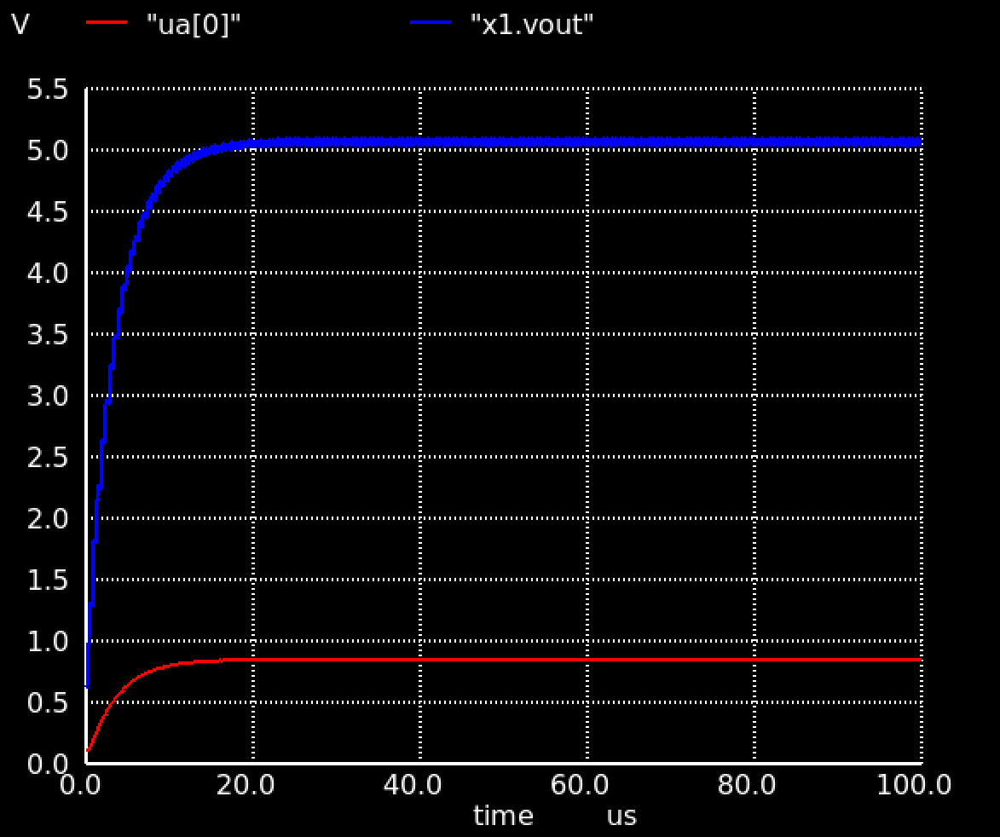
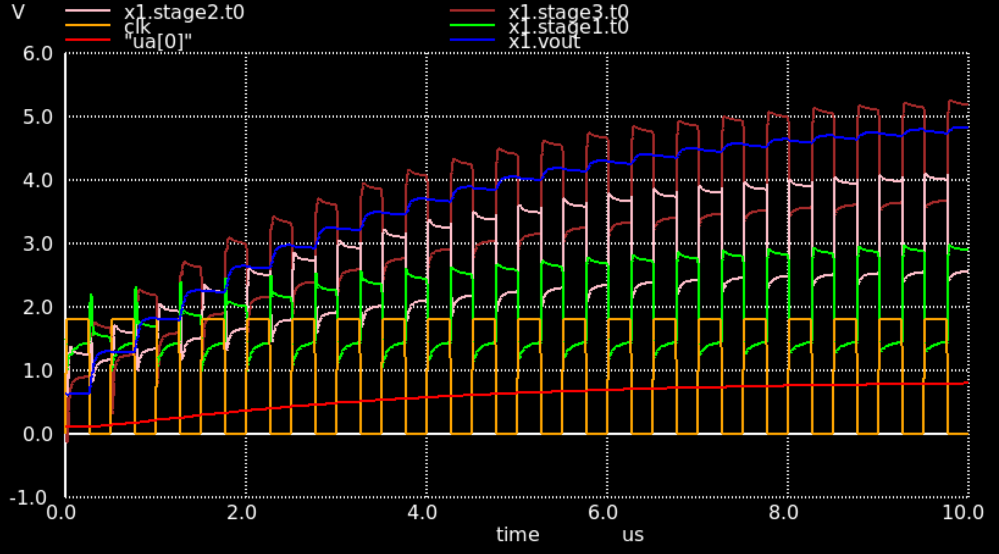

<!---

This file is used to generate your project datasheet. Please fill in the information below and delete any unused
sections.

You can also include images in this folder and reference them in the markdown. Each image must be less than
512 kb in size, and the combined size of all images must be less than 1 MB.
-->

## How it works

A 3-stage dickson charge pump. The output voltage is `Vout = 4*(VPWR - Vths) = ~5.44 V` where `VPWR` is the digital input voltage (1.8 V), and Vths is the threshold voltage of the LVS NMOS (nominal 0.44 V when width=7, length=8).

## How to test

Apply a clock signal of 2 MHz to the `clk` input. In TT06, the analog pin voltage is limited to 1.8 V, so the output voltage will be divided by 6. You can measure the divided output voltage at the `ua[0]` (vout_div) pin.

## Simulation results

Post layout simulation showing the output voltage `x1.vout` and the divided output voltage on ta `ua[0]` pin, with ~16.8 mega ohms load (the internal voltage divider). The output voltage stabilizes at ~5.07 V, and the divided output voltage at ~0.85 V. The current draw is about 355 nA.

The following graph shows the input clock, the intermediate voltages at the output of each stage, the output voltage, and the divided voltage as they rise during the first 10 us of operation.

